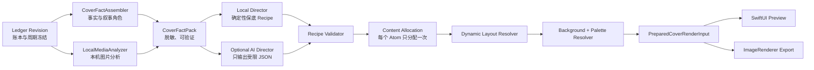
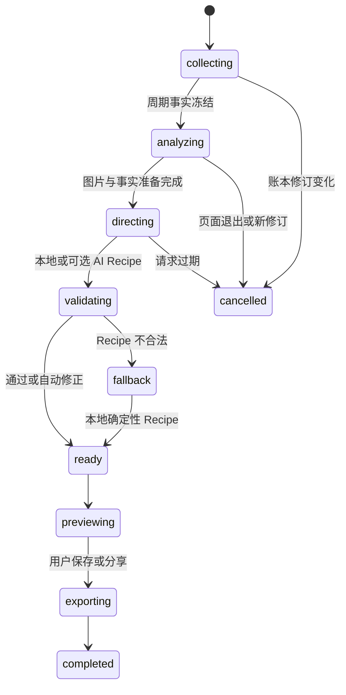
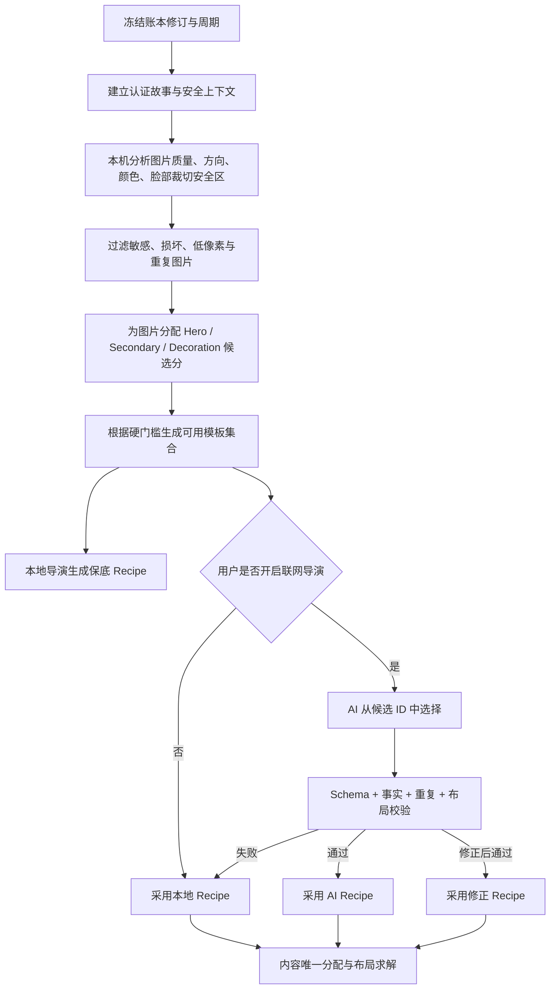

# 叙账 AI Cover Engine + Dynamic Template System v1

> Every Bill Tells a Story.
> 每一笔记录，都值得被回忆。

状态：产品与技术方案评审稿；不包含生产代码修改。
目标画布：9:16，逻辑尺寸 540 × 960，推荐导出 1080 × 1920。
目标气质：Apple Memories × Apple Journal × 安静的摄影杂志，但不复制任何第三方品牌、商标或具体界面。

---

## 0. 结论先行

这次不再修旧海报上的某个 Footer，而是替换分享系统的“内容分配、导演决策、模板描述和渲染根节点”。

新系统必须遵守六条硬规则：

1. **一个语义，只出现一次。** 标题、故事、照片说明、标签、指标、品牌分别拥有唯一 `ContentAtomID`，同一 Atom 不得进入两个区域。
2. **Footer 全局唯一。** 模板只能声明底部预留高度，不能实现自己的 Footer；品牌、日期、记录数、照片数、真实二维码只能由根渲染器画一次。
3. **AI 只做导演，不画图、不写任意布局代码。** AI 只能从允许的模板、色板、背景、字体角色和布局变体中选择，并输出可验证的 `CoverRecipe`。
4. **程序拥有最终决定权。** 任何 AI Recipe 只要事实越界、重复、溢出、图片资格不足或对比度不合格，立即修正或降级到确定性本地 Recipe。
5. **预览与导出同源。** 两者必须消费同一个不可变 `PreparedCoverRenderInput`；保存时不联网、不重新选模板、不重新读照片、不重新生成文案。
6. **故事是主体，数据只在 Footer。** 主体区域禁止记录数量卡、统计卡、关键词卡和 App 式面板堆叠。

推荐的实施策略不是一次写 20 个独立 SwiftUI 大 View，而是先建立一个约束式模板引擎，再让 20 套模板成为数据描述。

---

## 1. 为什么旧方案会反复出现底部重复

### 1.1 台账已有三次相关记录

- `UI-02` 已记录浅色模板同时存在顶部品牌、底部大品牌条和二维码，品牌与指标层级重复。
- `UI-02` 完成记录曾要求“品牌只在顶部出现一次，底部改为紧凑事实指标”。
- `SHARE-03` 再次要求“一条主线、一条辅助、最多两个生活线索”，并要求底部只在不重复时出现。

本次真机再次出现底部重复，说明旧架构允许问题回流，历史修复只是局部约定，不是结构约束。

### 1.2 当前代码根因

1. 仓库内并存两套分享渲染器：
   - `SummaryPlaybackSheet.swift` 的 `WeeklyStoryShareCardView`
   - `InsightWebView.swift` 的 `WeeklyShareCardView`
2. `WeeklyStoryShareCardView` 内每种模板都拥有完整的垂直结构，并可自行选择：
   - `lifeSlicePosterFooter`
   - `lifeSlicePosterBrandFooter`
   - `filmPosterFooter`
3. Hero/Warm Light 路径先渲染 `warmLightMetricBar`，其内容是记录数、记录日、照片数；随后又渲染 `lifeSlicePosterBrandFooter`，再次显示完全相同的 `posterSummaryMetricText`。
4. Clean/Custom Background 路径也会先绘制三项指标，再调用包含同一指标串的 Footer。
5. `PosterCopyModel` 同时计算 `title / subtitle / tagline / body`，每个字段都有多层 fallback；即便做字符串归一化，也无法证明同一事实没有被不同措辞重复投到多个区域。
6. 模板、文案选择、事实 fallback 和 SwiftUI 排版混在同一大型 View 中，增加一种模板就会复制一次 Footer 与 fallback 逻辑。

### 1.3 必须删除的设计自由度

- 模板不得自行创建 Footer。
- 模板不得直接读取原始 payload 并自行挑文案。
- ViewBuilder 不得拥有事实 fallback。
- 同一个指标不得同时进入主体和 Footer。
- 两个入口不得各自维护一套分享 View。
- 不允许用“字符串看起来不一样”逃避语义重复检查。

---

## 2. 系统边界

### AI 可以做

- 在经过隐私处理的事实包中判断本期的叙事重心。
- 从允许的模板能力集合中选择模板与布局变体。
- 从允许的色板、背景、光影、纹理和字体角色中选择组合。
- 选择已评分图片的角色：Hero、Secondary、Decoration。
- 给出选择理由、置信度和确定性 seed。

### AI 不可以做

- 直接画背景或图片。
- 生成 SwiftUI、坐标、任意字体名或任意阴影参数。
- 重新解释金额、日期、地点、人物关系或照片内容。
- 从人脸推断身份、年龄、性格或情绪。
- 绕过敏感内容过滤。
- 添加 Recipe Schema 中不存在的元素。
- 在打开分享页、切模板或保存时发起请求。

### 程序负责

- 事实冻结、图片准备、质量分析、隐私过滤。
- 本地确定性导演保底。
- AI Recipe 校验与降级。
- 布局求解、动态取色、背景绘制、动画和导出。
- Recipe/RenderInput 缓存与旧修订拒绝。

---

## 3. AI Cover Engine 架构



### 3.1 模块职责

| 模块 | 输入 | 输出 | 核心约束 |
|---|---|---|---|
| `CoverFactAssembler` | 周/月记录、现有 Narrative Plan | `CoverFactPack` | 不新造事实 |
| `LocalMediaAnalyzer` | 已准备的本地图片 | `MediaDescriptor[]` | 默认不上传图片 |
| `TemplateEligibilityEngine` | FactPack、图片能力 | 模板候选及分数 | 硬门槛先于 AI |
| `LocalCoverDirector` | 候选、事实、seed | 保底 Recipe | 离线必可用 |
| `AICoverDirector` | 脱敏 FactPack、候选 ID | AI Recipe | JSON Schema、可选联网 |
| `CoverRecipeValidator` | Recipe、FactPack | 修正/拒绝结果 | 重复、溢出、隐私、对比度 |
| `ContentAllocationEngine` | 故事与事实 Atom | `ContentAllocationPlan` | Atom 唯一消费 |
| `DynamicLayoutResolver` | Template、Allocation、媒体 | 绝对布局结果 | 不在 View 中猜布局 |
| `BackgroundResolver` | Recipe、色板、seed | 绘制指令 | 程序生成，不调用 AI 画图 |
| `CoverRenderCache` | source key、Recipe key | 不可变 RenderInput | 旧修订不反写 |
| `CoverExportCoordinator` | RenderInput | PNG/JPEG | 预览导出同源 |

### 3.2 状态机



---

## 4. 事实包与“内容只出现一次”机制

### 4.1 CoverFactPack

```swift
struct CoverFactPack: Codable, Equatable, Sendable {
    let schemaVersion: Int
    let sourceRevision: Int
    let periodKey: String
    let periodLabel: String
    let story: CertifiedStory
    let support: CertifiedStory?
    let marks: [CertifiedLabel]
    let footerFacts: FooterFacts
    let media: [MediaDescriptor]
    let context: SafeCoverContext
    let privacy: CoverPrivacyPolicy
    let contentFingerprint: String
}
```

只允许已有叙事系统认证后的事实进入：

- `lead`：本期唯一主线。
- `support`：最多一条，且与 lead 不同义。
- `marks`：最多两个稳定生活线索，不得重新充当主线。
- `footerFacts`：记录数、记录日、照片数、日期、品牌。
- `media`：只含图片描述符和稳定 ID，不含 AI 猜测。

### 4.2 ContentAtom

```swift
struct CoverContentAtom: Identifiable, Equatable, Sendable {
    enum Role: String, Codable {
        case masthead
        case storyLead
        case storySupport
        case photoCaption
        case lifeMark
        case timeline
        case footerMetric
        case brand
        case qrCode
    }

    let id: String                 // 来自事实 ID，而不是文本 hash
    let role: Role
    let text: String
    let evidenceItemIDs: [UUID]
    let semanticKey: String        // 例如 count:record、story:lead:xxx
    let priority: Int
}
```

### 4.3 ContentAllocationPlan

模板得到的不是完整 payload，而是已经分配好的区域内容：

```swift
struct ContentAllocationPlan: Equatable, Sendable {
    let masthead: [CoverContentAtom]
    let storyLead: CoverContentAtom
    let storySupport: CoverContentAtom?
    let mediaCaptions: [UUID: CoverContentAtom]
    let marks: [CoverContentAtom]
    let timeline: [CoverContentAtom]
    let footer: [CoverContentAtom]
    let consumedAtomIDs: Set<String>
}
```

Validator 必须满足：

```text
所有可见区域的 Atom ID 并集 == consumedAtomIDs
任意 Atom ID 的出现次数 <= 1
任意 semanticKey 的出现次数 <= 1
brand 的出现次数 == 1
footerMetric 只能存在于 footer
qrCode 只有真实 URL 且扫码测试通过时才存在
```

这样可以从架构上禁止“指标条＋底部再写同一指标”。

---

## 5. AI 导演决策流程



### 5.1 决策顺序

1. **隐私与事实资格**：先过滤，不让 AI 决定是否越界。
2. **媒体能力**：图片数量只是条件之一，清晰度、比例、裁切安全、故事相关性同样重要。
3. **故事强度**：是否有可信 lead、support、回声、时间线或地点。
4. **模板硬门槛**：不合格模板直接移出候选。
5. **模板适配分**：图片、故事、色彩、时间、地点、节奏综合评分。
6. **多样性冷却**：连续数期不重复同一模板，但不能为了不同而选不合格模板。
7. **AI 选择**：只在前 3～5 个合法候选中选。
8. **Validator**：最终否决权在本地。

### 5.2 AI 输出不得包含

- 任意正文文案。
- 任意图片内容描述。
- 任意坐标数组。
- 任意字体文件名。
- 任意二维码内容。
- 未在候选集合中的模板、色板或背景。

---

## 6. Dynamic Template Engine 架构

### 6.1 模板是描述，不是完整 View

```swift
struct CoverTemplateDescriptor: Codable, Equatable, Sendable {
    let id: CoverTemplateID
    let displayName: String
    let supportedPhotoCounts: ClosedRange<Int>
    let supportedOrientations: Set<MediaOrientation>
    let minimumHeroScore: Double?
    let requiredSignals: Set<CoverSignalRequirement>
    let allowedSlots: [CoverSlotDescriptor]
    let layoutVariants: [CoverLayoutVariant]
    let preferredBackgroundFamilies: [BackgroundFamily]
    let typographyFamily: TypographyFamily
    let animationProfile: CoverAnimationProfile
}
```

### 6.2 固定语义槽位

- `masthead`：周期或系列名，最多一行。
- `storyLead`：唯一主标题，1～3 行。
- `storySupport`：最多一条辅助故事，0～3 行。
- `heroMedia`：0 或 1 张。
- `secondaryMedia`：0～5 张。
- `editorNote`：只允许 support，不允许重复 lead。
- `marks`：0～2 个，视觉弱化。
- `timeline`：模板要求时使用。
- `footerReserve`：只预留空间，不渲染内容。

### 6.3 根渲染树

```swift
CoverCanvasRoot
 ├─ BackgroundRenderer
 ├─ TemplateBodyRenderer
 │   ├─ MastheadRenderer
 │   ├─ StoryRenderer
 │   ├─ MediaRenderer
 │   ├─ SupportRenderer
 │   └─ MarkRenderer
 └─ GlobalFooterRenderer       // 全系统唯一 Footer
```

两个旧分享入口最终都必须路由到同一个 `CoverShareFlow`，不再各自维护渲染器。

---

## 7. 模板选择流程

### 7.1 硬门槛

| 条件 | 处理 |
|---|---|
| 0 张合格图 | 只允许 Quote、Journal、Timeline、Minimal、Quiet Editorial |
| 1 张图且 Hero < 0.62 | 不允许 Full Photo、Book Cover |
| 2～3 张图 | 允许 Hero + Secondary、Magazine、Editorial、Memory Focus |
| 4～6 张图 | 允许 Scrapbook、Memory Wall、Magazine，不允许等大宫格 |
| 7+ 张图 | 最多选择 7 张；Timeline/Gallery/Masonry，剩余不进入封面 |
| 无可信故事 lead | 禁止 Quote、Book Cover；回退 Journal/Timeline |
| 敏感照片或高风险 OCR | 禁止 Hero；可完全不使用该图 |
| 图片像素不足 | 只能 Secondary/Decoration，不可放大为 Hero |
| 真实地点与路线不足 | 禁止 Travel Note/Postcard 的地图语义 |

### 7.2 模板适配分

```text
TemplateFit =
    0.28 × MediaCapability
  + 0.24 × StoryCompatibility
  + 0.14 × OrientationFit
  + 0.12 × ContextFit
  + 0.10 × PaletteFit
  + 0.07 × CopyLengthFit
  + 0.05 × DiversityBonus
  - HardPenalty
```

`HardPenalty` 只要触发隐私、像素、缺图或槽位超限，模板直接淘汰，不参与排序。

---

## 8. 图片评分算法

图片分析默认在本机完成。Vision 只做脸部矩形与裁切安全，不做人脸身份、年龄、性别或情绪推断。

### 8.1 单图评分

```text
HeroScore = clamp(
    0.12 × Sharpness
  + 0.10 × Exposure
  + 0.08 × DynamicRange
  + 0.08 × ResolutionFitness
  + 0.07 × CropSafety
  + 0.08 × Composition
  + 0.07 × SubjectSalience
  + 0.12 × StoryEvidenceMatch
  + 0.09 × NarrativeRoleMatch
  + 0.06 × TimePlaceSpecificity
  + 0.05 × Uniqueness
  + 0.04 × PaletteHarmony
  + 0.04 × NegativeSpace
  - Penalties,
  0, 1)
```

### 8.2 处罚项

| 情况 | 处罚/结果 |
|---|---:|
| 严重模糊 | `-0.35`，不得 Hero |
| 严重过曝/欠曝 | `-0.25` |
| 小于目标 Hero 像素 | `-0.25`，只能 Secondary |
| 收据、支付截图、聊天截图 | `-0.30`，默认不作 Hero |
| 高敏 OCR | 硬拒绝，不进入封面 |
| 与已选 Hero 感知重复 | `-0.24` |
| 主体贴边且无法安全裁切 | `-0.18` |
| 仅因有人脸但无故事关系 | 不加分 |

### 8.3 角色分配

- `Hero`：最高 HeroScore，且与 lead evidence ID 一致或为独立明确画面。
- `Secondary`：选择与 Hero 在时间、构图、颜色或内容上有互补性的图片，不简单取第二高分。
- `Decoration`：局部纹理、纸片、胶片小格；不得承载唯一关键证据。

辅助图选择使用最大边际相关性：

```text
SecondaryGain = 0.55 × BaseScore
              + 0.25 × StoryComplement
              + 0.20 × VisualDiversity
              - 0.35 × SimilarityToSelected
```

---

## 9. 动态布局算法

### 9.1 画布与安全区

- 逻辑画布：`540 × 960`。
- 导出：`1080 × 1920`；必要时 3x 输出，但所有布局仍以逻辑尺寸求解。
- 外边距：32；顶部安全区：32；底部 Footer 安全区：58～72。
- 6 列栅格；列间距 12；基础间距单位 4。

### 9.2 图片面积原则

- Hero：视觉图片面积的 58%～72%。
- Secondary 合计：18%～32%。
- Decoration：0%～10%。
- 4 张以上使用不对称 masonry、叠放或时间带；禁止全部等大。

### 9.3 求解顺序

```text
1. 锁定 footerReserve
2. 测量 masthead、lead、support 的最小/理想高度
3. 计算媒体可用区域
4. 根据图片方向组合选择 layoutVariant
5. 对 Hero 做 crop-safe 拟合
6. 对 Secondary 做互补排布
7. 检查文字行数、对比度、最小字号和碰撞
8. 失败则依次：缩短 support → 隐藏 marks → 换 compact variant → 换模板
9. 不允许把 lead 截成省略号后强行导出
```

### 9.4 文案长度预算

| 区域 | 字数建议 | 最大行数 |
|---|---:|---:|
| Masthead | 8～26 | 1 |
| Lead | 8～30 | 3 |
| Support | 12～48 | 3 |
| Photo Caption | 6～22 | 2 |
| Mark | 2～8 | 1 |
| Footer | 固定格式 | 1 |

---

## 10. 动态背景生成算法

背景不是一张 AI 图片，而是可重复渲染的图层配方。

### 10.1 图层

1. Base：纯色或低对比渐变。
2. Light：窗影、帘影、叶影、夕阳、反射。
3. Material：纸纹、胶片、噪点、压花。
4. Decoration：胶带、邮戳、铅笔线、地图线、咖啡渍。
5. Edge：暗角或纸张边缘，仅 2%～6%。

### 10.2 透明度约束

- 光影：6%～18%。
- 纹理：3%～10%。
- 装饰：5%～15%。
- Film Grain：2%～8%。
- 咖啡渍：最多一个，3%～7%，只能用于 Coffee Story。

### 10.3 性能

- Recipe 确定后在后台预渲染背景位图；SwiftUI body 不反复生成噪点。
- seed 由 `contentFingerprint + templateID + recipeVersion` 生成，同一账本修订结果稳定。
- 预览与导出共用背景缓存。

---

## 11. 动态取色算法

### 11.1 有 Hero 图片

1. 将图片降采样到 64 × 64。
2. 转换到 CIELAB。
3. 去除极亮、极暗和面积过小的离群点。
4. K-Means 提取 5 个颜色簇。
5. 选择稳定主色、辅助色和强调色。
6. 把饱和度压到 `0.08...0.32`，避免“照片同款高饱和 UI”。
7. 生成纸色背景与墨色文字。
8. 校验正文对比度 ≥ 4.5:1，次要文字 ≥ 3:1。

### 11.2 无图片

从受控上下文选择色板，不从分类直接推断情绪：

- 清晨/白天：Cream、Morning Green。
- 家中明确场景：Warm Beige。
- 夜间明确记录：Night Blue。
- 海边/水域明确地点：Ocean Blue。
- 旅行明确地点：Paper Gray + Travel Accent。
- 无上下文：Cream White。

### 11.3 色板约束

- 背景起止色 `ΔE` 建议 8～18。
- Accent 与正文不可同时高饱和。
- 从照片取到的肤色不得直接成为大面积背景主色。
- 深色模板最多占自动结果的 20%，避免每期都变成“电影夜景”。

---

## 12. BackgroundRecipe 数据结构

```swift
struct BackgroundRecipe: Codable, Equatable, Sendable {
    let family: BackgroundFamily
    let base: BaseLayer
    let light: LightLayer?
    let texture: TextureLayer?
    let decoration: DecorationLayer?
    let vignetteOpacity: Double
    let seed: UInt64
}

enum BackgroundFamily: String, Codable {
    case morningLight, warmHome, creamPaper, coffeeTime, forestDiary
    case travelNote, nightWalk, film, journal, editorial
    case nature, bookCover, ocean, autumn, minimal
    case postcard, quietEditorial, softUtility, sunset, paperGray
}

struct BaseLayer: Codable, Equatable, Sendable {
    let startHex: String
    let endHex: String
    let direction: GradientDirection
}

struct LightLayer: Codable, Equatable, Sendable {
    let type: LightPattern       // window / curtain / leaf / sunset / reflection
    let anchor: CanvasAnchor
    let rotationDegrees: Double
    let opacity: Double
    let blurRadius: Double
}

struct TextureLayer: Codable, Equatable, Sendable {
    let paperOpacity: Double
    let grainOpacity: Double
    let fiberScale: Double
    let embossOpacity: Double
}

struct DecorationLayer: Codable, Equatable, Sendable {
    let type: DecorationKind     // tape / stamp / map / pencil / coffeeRing
    let anchor: CanvasAnchor
    let opacity: Double
    let scale: Double
    let rotationDegrees: Double
}
```

JSON 示例：

```json
{
  "family": "morningLight",
  "base": {
    "startHex": "#F8F5EE",
    "endHex": "#EEF5F0",
    "direction": "topLeadingToBottomTrailing"
  },
  "light": {
    "type": "window",
    "anchor": "topRight",
    "rotationDegrees": -8,
    "opacity": 0.12,
    "blurRadius": 5
  },
  "texture": {
    "paperOpacity": 0.08,
    "grainOpacity": 0.04,
    "fiberScale": 1.1,
    "embossOpacity": 0.02
  },
  "decoration": {
    "type": "pencil",
    "anchor": "bottomLeft",
    "opacity": 0.08,
    "scale": 0.9,
    "rotationDegrees": 3
  },
  "vignetteOpacity": 0.03,
  "seed": 89121
}
```

---

## 13. CoverRecipe 数据结构

```swift
struct CoverRecipe: Codable, Equatable, Sendable {
    let schemaVersion: Int
    let recipeID: String
    let source: CoverRecipeSource
    let sourceRevision: Int
    let periodKey: String
    let contentFingerprint: String
    let template: TemplateSelection
    let palette: CoverPaletteRecipe
    let background: BackgroundRecipe
    let typography: TypographyRecipe
    let content: ContentRecipe
    let media: [MediaPlacementRecipe]
    let footer: FooterRecipe
    let animation: CoverAnimationRecipe
    let seed: UInt64
    let confidence: Double
    let reasonCodes: [CoverDirectorReason]
}

struct TemplateSelection: Codable, Equatable, Sendable {
    let templateID: CoverTemplateID
    let variantID: String
}

struct ContentRecipe: Codable, Equatable, Sendable {
    let leadAtomID: String
    let supportAtomID: String?
    let markAtomIDs: [String]
    let timelineAtomIDs: [String]
}

struct MediaPlacementRecipe: Codable, Equatable, Sendable {
    let mediaID: UUID
    let role: MediaRole             // hero / secondary / decoration
    let slotID: String
    let cropMode: CropMode
    let treatment: MediaTreatment   // clean / paper / film / polaroid
}

struct FooterRecipe: Codable, Equatable, Sendable {
    let style: FooterStyle
    let atomIDs: [String]
    let showsVerifiedQRCode: Bool
}
```

AI 只输出模板、variant、palette/background token、媒体角色、动画 profile 与原因；Hex 色值、绝对坐标、正文文字由本地 resolver 填充。

AI JSON 示例：

```json
{
  "schemaVersion": 1,
  "templateID": "heroStory",
  "variantID": "portraitHeroBottom",
  "paletteID": "creamMorning",
  "backgroundFamily": "morningLight",
  "mediaRoles": [
    {"mediaID": "A1", "role": "hero"},
    {"mediaID": "A2", "role": "secondary"}
  ],
  "animationProfile": "gentleEditorial",
  "seed": 89121,
  "confidence": 0.91,
  "reasonCodes": ["strongPhotoLead", "warmPalette", "shortStory"]
}
```

---

## 14. SwiftUI 实现建议

### 14.1 文件边界

```text
CoverEngine/
  Models/
    CoverFactPack.swift
    CoverRecipe.swift
    BackgroundRecipe.swift
    CoverTemplateDescriptor.swift
  Director/
    LocalCoverDirector.swift
    AICoverDirector.swift
    CoverRecipeValidator.swift
  Analysis/
    LocalMediaAnalyzer.swift
    CoverPaletteExtractor.swift
    CoverPrivacyPolicy.swift
  Layout/
    ContentAllocationEngine.swift
    DynamicLayoutResolver.swift
    CoverTextFitter.swift
  Rendering/
    CoverCanvasRoot.swift
    TemplateBodyRenderer.swift
    GlobalFooterRenderer.swift
    BackgroundRenderer.swift
  Flow/
    CoverPreparationStore.swift
    CoverShareFlow.swift
    CoverExportCoordinator.swift
```

### 14.2 渲染输入

```swift
struct PreparedCoverRenderInput: @unchecked Sendable {
    let sourceKey: String
    let recipe: CoverRecipe
    let allocation: ContentAllocationPlan
    let layout: ResolvedCoverLayout
    let preparedImagesByID: [UUID: UIImage]
    let backgroundImage: UIImage?
}
```

### 14.3 关键实现原则

- `CoverCanvasRoot` 是唯一能渲染 Footer 的 View。
- 模板体只能读取 `ResolvedCoverLayout`，不能读取 `WeeklyShareCardPayload`。
- 所有图片在进入 RenderInput 前完成读取、降采样和预解码。
- `ImageRenderer` 导出只读取同步值；导出树中禁止 `.task`、`ProgressView` 和异步图片 View。
- Recipe 与 RenderInput 以账本修订、周期、媒体指纹、规则版本为 key。
- 切模板只重新求解 Recipe/Layout，不重扫账本、不重新读取照片。
- AI 结果提前准备；打开分享页和保存时零网络请求。
- 两个旧入口先通过 Adapter 接入新 Flow，完成签收后删除旧渲染器，不能长期双轨。

### 14.4 可访问性

- 分享成品不是交互界面，不跟随无限 Dynamic Type；但编辑预览与按钮必须支持 Dynamic Type。
- 提供整张封面的 VoiceOver 摘要：周期、主故事、图片数量、底部事实。
- Reduce Motion 使用 180ms 淡入，不做飞入、旋转和景深。
- 深浅背景均通过本地对比度校验。

---

## 15. Figma 参数

### 15.1 画布与栅格

| 参数 | 值 |
|---|---:|
| 设计画布 | 540 × 960 |
| 导出画布 | 1080 × 1920 |
| 外边距 | 32 |
| 栅格 | 6 列 |
| Gutter | 12 |
| 基础间距 | 4 |
| Footer Reserve | 64 |
| Footer 底边距 | 24 |

### 15.2 字体

| 角色 | 字体 | 字号 | 行高 | 字重 |
|---|---|---:|---:|---|
| Display Lead | Songti SC / New York fallback | 38～48 | 1.12 | Semibold/Bold |
| Editorial Lead | PingFang SC | 34～42 | 1.16 | Semibold |
| Support | PingFang SC | 15～18 | 1.55 | Regular/Medium |
| Handwritten Accent | Kaiti SC | 18～22 | 1.45 | Regular |
| Masthead | PingFang SC | 11～13 | 1.2 | Semibold |
| Caption | PingFang SC | 11～13 | 1.35 | Medium |
| Footer | PingFang SC / SF Pro | 10～11 | 1.2 | Medium |

手写字体只能用于一句短注，不得承担长正文。

### 15.3 圆角

- Full bleed：0。
- Hero Photo：18～24。
- Secondary Photo：12～16。
- Paper/Polaroid：8～12。
- Quote Paper：18。
- 小标签：999，但最多两个。

### 15.4 阴影

| 名称 | X/Y | Blur | Spread | Color |
|---|---|---:|---:|---|
| Photo Soft | 0 / 10 | 24 | 0 | `#1D2A22` 10% |
| Paper Lift | 0 / 6 | 16 | 0 | `#342C24` 9% |
| Floating Hero | 0 / 18 | 36 | 0 | `#132019` 14% |

同一封面最多使用一种主阴影，不叠三层材质阴影。

### 15.5 色彩建议

| Token | 示例 |
|---|---|
| Cream White | `#F8F5EE` |
| Warm Beige | `#E9DDCC` |
| Morning Green | `#CAD9C7` |
| Fog Green | `#DDE5DD` |
| Coffee Brown | `#7D6353` |
| Olive | `#77806A` |
| Sunset Orange | `#C9825A` |
| Ocean Blue | `#7897A5` |
| Night Blue | `#263543` |
| Paper Gray | `#E7E4DE` |
| Ink | `#242421` |
| Muted Ink | `#66635D` |

---

## 16. 20 套模板与适用场景

第三方名称只作为设计参考；产品内建议使用“用户显示名”，避免造成官方关联暗示。

| # | 内部 ID | 用户显示名 | 适用图片 | 适用场景 | 核心版式 | 动画 |
|---:|---|---|---:|---|---|---|
| 1 | `heroStory` | 主角故事 | 1～3 | 有强 Hero 与明确主线 | 大图 65%，标题与一句故事 | Hero 缓入 |
| 2 | `magazine` | 杂志版面 | 2～5 | 图像质量均衡、故事＋辅助 | 1 大 2 小，不等大 | 分层淡入 |
| 3 | `memoryFocus` | 回忆聚焦 | 1～3 | 具体时刻、人物裁切安全 | 大留白＋单图焦点 | 景深淡入 |
| 4 | `journal` | 生活手札 | 0～3 | 文字/时间信息丰富 | 纸张、短文、日期 | 纸张展开 |
| 5 | `film` | 胶片故事 | 2～7 | 时间连续、夜景、路上 | 非等大胶片带 | 顺序显影 |
| 6 | `minimal` | 留白 | 0～1 | 弱数据、短故事 | 极简标题＋小图/无图 | 纯淡入 |
| 7 | `quote` | 一句话 | 0～1 | 有高置信短 lead | 大标题＋背景光影 | 字句浮现 |
| 8 | `timeline` | 时间线 | 0～7 | ≥3 个记录日 | 日期节奏＋1～3 图 | 自上而下 |
| 9 | `postcard` | 明信片 | 1～2 | 明确地点/旅行 | 图片＋邮戳/地址线 | 轻微位移 |
| 10 | `scrapbook` | 拼贴手账 | 3～7 | 图片多且风格多样 | 叠放、胶带、纸片 | 逐片落位 |
| 11 | `editorial` | 编辑精选 | 2～4 | 主线和 Editor Note 都强 | 标题、Hero、侧栏 | 切页淡入 |
| 12 | `memoryWall` | 记忆墙 | 4～9 | 多张合格图片 | 非对称 masonry | 分批出现 |
| 13 | `travelNote` | 旅行札记 | 2～6 | 明确路线/地点 | 地图线＋图片＋手记 | 路线绘制 |
| 14 | `bookCover` | 书封 | 1 | 纵向高质量 Hero＋短标题 | 书名式标题＋单图 | 封面推进 |
| 15 | `natureDiary` | 自然日记 | 1～4 | 明确户外/自然色 | 图像＋叶影＋观察句 | 叶影缓移 |
| 16 | `coffeeStory` | 咖啡片段 | 1～3 | 明确咖啡且本期有变化/照片 | 暖棕、杯渍、单图 | 蒸汽式淡入 |
| 17 | `warmHome` | 家中片刻 | 1～4 | 明确家中生活、隐私安全 | 暖纸色＋柔光 | 窗光渐显 |
| 18 | `nightStory` | 夜行故事 | 1～4 | 明确夜间且图像偏暗 | 深蓝、反射、胶片 | 暗场显影 |
| 19 | `ocean` | 海边记忆 | 1～4 | 明确海边/水域/蓝色主图 | 大留白、水平节奏 | 水光缓移 |
| 20 | `quietEditorial` | 静默编辑 | 0～2 | 克制、短故事、留白优先 | 小图＋大留白＋细字 | 极慢淡入 |

### 首发建议

架构支持 20 套，但生产首发建议只打开 6 套：主角故事、杂志版面、生活手札、一句话、时间线、留白。其余模板在同一引擎上分批开放。这样可以把排版、长文、真实照片和导出稳定性先验收，不再用 20 个独立 View 同时制造 20 份回归面。

---

## 17. 20 套高保真效果图生成规格

当前图像生成状态：`SPEC_READY / RENDER_PENDING`。当前桌面会话没有内置图像生成工具；不得未经用户同意改用需要 `OPENAI_API_KEY` 的 CLI 备用路径。

所有效果图的共同约束：

```text
Use case: ui-mockup
Asset type: 9:16 high-fidelity share-cover mockup, no phone frame
Style: original Chinese lifestyle photography magazine; warm, restrained, editorial, generous whitespace
Canvas: portrait 9:16
Required text: render each specified line exactly once
Footer: one single quiet footer only
Constraints: no data cards in body; no UI chrome; no equal-size grid; no QR code; no duplicate footer; no duplicate metrics; no Apple/Kinfolk/MUJI logos or trademarks; no watermark
```

### 逐图提示

1. **主角故事**：晨光咖啡馆，一张竖向咖啡照片占约 65%；标题“下班路上，也把这一刻留了下来”；辅助句“雨停以后，回家的路慢了一点”；Footer“叙账 · 12 笔记录 · 3 个记录日 · 1 张照片”。
2. **杂志版面**：晚餐 Hero＋通勤/咖啡两张辅助图，1 大 2 小；标题“这一周，晚饭终于不再匆忙”；Editor Note 一句；Footer 只出现一次。
3. **回忆聚焦**：一张自然人物背影或手部生活照，大留白、柔和景深；标题“周六的下午，被好好留下来了”；无标签卡。
4. **生活手札**：无图或一张小图，Cream Paper、日期、两段短手记、铅笔线；标题“没有拍照的一周，生活也没有缺席”。
5. **胶片故事**：夜间通勤和路灯 4 张不同大小胶片格；标题“夜色把回家的路连成一卷”；胶片编号只作装饰。
6. **留白**：0 图，90% 留白、窗影和一句话；标题“这周很安静，但并不是空白”；Footer 极弱。
7. **一句话**：0～1 张极小图片；大字“连续第三周，周二晚饭，你又来到这里”；背景只有纸纹与叶影。
8. **时间线**：本周 4 个记录日，竖向时间线配 2 张错落图片；标题“从周一到周日，生活有自己的节奏”。
9. **明信片**：旅行街景 Hero＋一张票根式辅助，但不虚构票据文字；标题“南京的风，留在了这一页”；邮戳为抽象日期装饰。
10. **拼贴手账**：5 张生活照叠放，Hero 明显更大，胶带与纸边；标题“这一周，零碎得刚刚好”。
11. **编辑精选**：两张图片、窄侧栏 Editor Note；标题“编辑这一周：晚饭、雨和一段慢路”。
12. **记忆墙**：6 张不对称 masonry，最大图约 45%，其余递减；标题“六个瞬间，拼成了这一周”。
13. **旅行札记**：地图线、两处地点文字、3 张图片；标题“从玄武湖走到老门东”；不得生成真实导航 UI。
14. **书封**：单张高质量纵图，像一本摄影书封面；书名“七月，慢慢生活”；副题“2026.07.20—07.26”。
15. **自然日记**：植物、散步、天空 3 张图；Fog Green、叶影；标题“傍晚的风，把这一周吹松了一点”。
16. **咖啡片段**：明确有本期新变化才使用；咖啡 Hero＋小图，低饱和棕；标题“这一次，不只是那杯熟悉的咖啡”。
17. **家中片刻**：餐桌、灯光、居家小物 3 张，Warm Beige；标题“回到家以后，时间终于慢下来”。
18. **夜行故事**：深蓝城市、反光路面、1 大 2 小；标题“十点以后，城市还亮着一盏回家的灯”。
19. **海边记忆**：海面 Hero＋两张小图，低饱和蓝；标题“海风把这几天留得很轻”。
20. **静默编辑**：0～2 张小图，大量留白、细宋体；标题“这一周，不必说得太满”；一条短注与唯一 Footer。

每张图生成后必须做人工验收：文字准确、Footer 仅一次、指标只在 Footer、无 App 式卡片、图片有主次、无第三方商标、无水印。失败只针对一个问题迭代，不整套改写。

---

## 18. 播放结束到分享页的完整动效

### 18.1 计算时机

视觉上是“播放结束后封面生成”，但计算应在播放最后一章期间预热：

- 事实包、图片评分、Recipe、背景和图片解码提前准备。
- 播放结束只揭示已准备结果，不等待 AI 或图片 IO。
- 如果预热未完成，先保持播放完成页，按钮显示非阻断准备状态；绝不把加载状态画进封面。

### 18.2 1.35 秒时间线

| 时间 | 动作 |
|---:|---|
| 0–180ms | 播放内容轻淡出，背景基色出现 |
| 80–320ms | 窗影/纸纹以 0→目标透明度渐显 |
| 140–620ms | Hero 从 0.97 缩放到 1.0，位移 16→0 |
| 300–720ms | 标题逐行淡入，间隔 70ms |
| 480–900ms | Support/Editor Note 出现 |
| 640–1040ms | Secondary 图片按主次依次进入 |
| 820–1120ms | 唯一 Footer 淡入 |
| 1050–1350ms | 保存、分享、换一版按钮出现 |

### 18.3 动效原则

- 只用 opacity、offset、scale，避免复杂 3D 翻页造成掉帧。
- 图片飞入顺序遵循 Hero → Secondary → Decoration。
- 标题不做逐字打字机，避免廉价感和 VoiceOver 干扰。
- Reduce Motion：全流程 180ms crossfade。
- 用户快速点击保存时，只能保存当前已经锁定的 RenderInput。
- “换一版”只从合法候选取下一个 Recipe，不重新请求 AI，不重新读照片。

---

## 19. 实施顺序

### SHARE-REBUILD-01：契约与单一事实分配

- 建立 FactPack、ContentAtom、AllocationPlan、Recipe、Validator。
- 单元测试先证明同一 Atom/semanticKey 不可能出现两次。
- 不改现有 UI。

### SHARE-REBUILD-02：统一准备与渲染根节点

- 新建 `CoverShareFlow`、`PreparedCoverRenderInput`、`CoverCanvasRoot`、唯一 Footer。
- 两个旧入口通过 Adapter 使用同一新 Flow。
- 预览与导出一致性测试。

### SHARE-REBUILD-03：首发 6 模板

- 主角故事、杂志版面、生活手札、一句话、时间线、留白。
- 0/1/2/3/4+ 图及长文、敏感内容、无图覆盖。

### SHARE-REBUILD-04：本机图片分析与动态取色

- Vision/Core Image 本机评分、裁切安全、色板提取。
- 不做身份和情绪识别，不上传图片。

### SHARE-REBUILD-05：可选 AI 导演

- 只接收脱敏 FactPack 与合法候选 ID。
- JSON Schema、超时、本地降级、缓存、旧修订拒绝。

### SHARE-REBUILD-06：扩展至 20 模板并退役旧实现

- 分批补齐剩余模板。
- Xcode/真机全矩阵通过后删除旧 `WeeklyStoryShareCardView` 和 `WeeklyShareCardView`。
- 删除旧 Footer、旧样式枚举和不可达模板代码；不能长期双轨。

任何时刻只启动一项；前一项达到 `CODE_DONE` 并更新台账后再进入下一项。

---

## 20. 验收标准

### 内容

1. 同一故事事实、指标、品牌在成品中最多出现一次。
2. Footer 始终只有一个；模板代码无法自行渲染 Footer。
3. 数据只在 Footer，Header 与主体不展示统计卡。
4. 无图时不出现“等待上传、暂无图片、空白占位”。
5. 稳定咖啡等生活线索没有变化时不反复领衔。
6. 照片、标题和故事必须共享同一证据 ID；不瞎配图。

### 图片

1. 图片有 Hero/Secondary/Decoration 主次，不出现等大九宫格。
2. 低像素、模糊、敏感、收据/截图不被强行放大为 Hero。
3. 人脸只用于裁切安全，不推断人物信息或情绪。
4. 预览与导出图片、裁切、文案和背景完全一致。

### 性能与稳定性

1. 打开分享页、切模板、播放结束、保存均不发 AI 请求。
2. 保存树零异步图片、零加载态、零固定延迟。
3. 100/1,000/5,000 条账本下，同修订只准备一次 FactPack/Recipe。
4. 三张 12MP 图片无重复解码、无持续内存增长、无明显主线程 hitch。
5. 快速切模板 20 次、连续保存 20 次只接受最新 Recipe，且相册无重复写入。

### 视觉

1. 20 套模板在同一设计系统内，但构图、图片节奏和留白明显不同。
2. 正文对比度、最小字号、长文 fallback 和安全区全部通过。
3. 不展示仿二维码；真实二维码必须双机实扫。
4. 不出现第三方品牌标识或像素级仿制。

---

## 21. 本轮明确不做

- 不修改账单、OCR、生活线索、叙事事实和播放章节。
- 不修改会员、价格、额度、购买、StoreKit。
- 不在方案阶段修改生产代码。
- 不把“AI 导演”包装成图片内容识别或开放式编造。
- 不在新引擎签收前删除旧代码。
- 不继续给旧 Footer 打补丁；所有后续修复只落到新架构任务。
