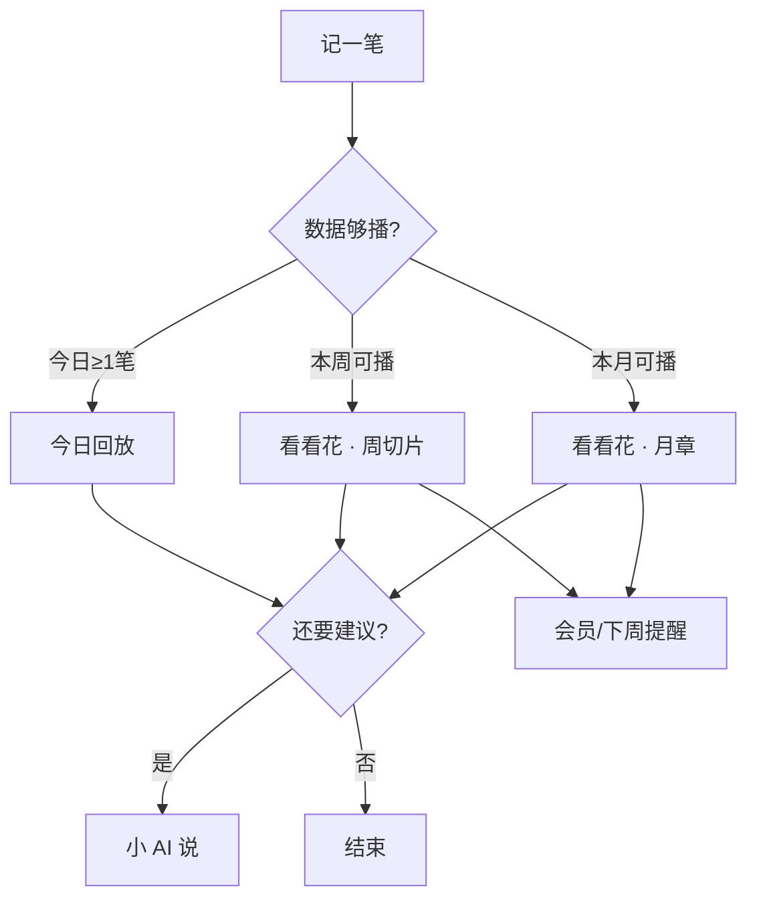

# 叙账 · 产品北极星

> 更新时间：2026-06-09  
> 状态：定稿（战略层；功能细则见 `PRD_v0.1.md`、`PRODUCT_PLAYBACK_MEMBERSHIP_v0.1.md`）  
> 读者：产品、设计、开发、运营、商店文案

---

## 0. 创始人意图 · 生活哲学

> **叙账不只是一款 App，也是创始人价值观的产品化表达。**  
> 所有功能、文案、视觉取舍，最终都在回答：我们希望用户以怎样的方式，看见自己的生活。

### 0.1 核心信念

**花钱不是要被审判的，而是要被理解的。**

消费是生活的痕迹，不是道德成绩单。叙账做的不是「帮你省」，而是帮用户站在周末、月末，**温柔地看见：这段日子我是怎么过的**。

与许多记账工具的隐含假设不同——它们默认你在 **管控** 自己；叙账默认你在 **理解** 自己。

### 0.2 「先叙后议」是一种生活态度

```text
先看见 → 再说话
先讲完 → 再建议
先接纳这段生活 → 再谈要不要微调
```

「先叙后议」不仅是功能顺序（切片 → 可选 AI），更是产品气质：**回望本身就有价值，不必靠「更聪明的建议」才值得存在。**

### 0.3 创始人级评审问句

新增功能、改文案、做商店表达时，先问：

> **这是在帮用户更温柔地看见自己的生活，还是在把叙账拉回「管钱工具」？**

| 倾向背离哲学 | 倾向强化哲学 |
|--------------|--------------|
| 严预算、剁手提醒、消费评分 | 生活切片、场景备注、温柔旁白 |
| 以 AI 诊断为主卖点 | 本地切片可闭环，AI 播后可选 |
| 阉割基础记账逼付费 | 记账与基础统计始终免费 |
| 审计式报表、评判式语气 | 周记式叙述、陪伴式回望 |

### 0.4 一句话定义（内部共识）

**叙账相信的一种活法：认真记录，但不急于评判；愿意回看，也允许自己就是这样过了一段日子。**

产品、文案、图标、商店截图——都是在把这句话，变成用户手机上 **30 秒能听见的体验**。

详见 [`PRODUCT_STAGE_REVIEW_AND_STORE_COPY_v0.1.md`](PRODUCT_STAGE_REVIEW_AND_STORE_COPY_v0.1.md) §3.6～§3.7（价值传达 × 感染力 × 哲学落地）。

### 0.5 「议」的边界 · AI 不复述预算教练

> **「先叙后议」里，「议」是对已发生生活的轻交谈，不是对下月的数字管控。**  
> 完整待改清单见 [`AI_ADVICE_BOUNDARY_AUDIT_v0.1.md`](AI_ADVICE_BOUNDARY_AUDIT_v0.1.md)（代码暂未改）。

#### 0.5.1 时间方向

| 方向 | 叙账立场 | 示例 |
|------|----------|------|
| **回望（叙）** | ✅ 主路径 | 「这个月餐饮出现得勤，有几笔像犒劳自己」 |
| **理解（议）** | ✅ 播生活章 / 切片 **之后** 可选 | 「若下月还想对照变化，继续记就好——不必定目标数」 |
| **管控（预算）** | ❌ 与哲学冲突 | 「下月参考 ¥X」「设温柔小预算」「达成率」「比本月少 5%」 |

**冲突判据**：若输出含 **下月/下周 numeric 目标**、**预算上限**、**减少 X%**、**达成率/收敛波动**——即使用「温柔」「参考」「随心调整」包装，仍属 **预算教练时间线**，不是叙账。

#### 0.5.2 「议」可以做什么

- 复述 **已发生** 的结构与节奏（分类、笔数、主线）  
- 一句 **感受性收束**（像朋友总结你这周/月）  
- 邀请 **继续记、下月再叙时对照**（不给数字）  
- 播完生活章后的 **「想多聊一句」**（短、可选、可跳过）

#### 0.5.3 「议」不应做什么

- 给出下月/下周 **金额参考值**（含 `total × 0.95` 等隐含缩减算法）  
- 「设预算」「分段预算」「预算上限」「达成率」  
- 「减少一次消费」「控制预算」「优化消费结构以省钱」  
- 替代 **生活切片 / 生活章** 成为月度主体验  
- 在商店或 Tab 文案中以 **AI 记账 / 智能理财** 为主叙事  

#### 0.5.4 与现有文档的关系

| 文档 | 约束 |
|------|------|
| 本文 §0.3 | 创始人级功能取舍 |
| `PRODUCT_PLAYBACK_MEMBERSHIP_v0.1.md` §5.8 | 切片旁白禁止说教、控、省钱 |
| `PLAYBACK_COPY_POOL_v0.2.md` §1 | 切片池禁用词 |
| `AI_ADVICE_BOUNDARY_AUDIT_v0.1.md` | iOS / Web / Prompt 待改项与优先级 |

**Prompt 层**：`action` 字段宜改为 **收束 / 感受 / 邀请再叙**，PRD 中「可执行建议」在 v0.2 应修订为 **不与预算同义** 的表述。

#### 0.5.5 已知冲突功能（待代码迭代）

| 功能 / 按钮 | 冲突点 | 建议方向（产品，非本次改码） |
|-------------|--------|------------------------------|
| 「柔和下月参考」 | `本月总额 × 0.95` → 下月 ¥X | 删除，或改为「记一句本月收束」 |
| 月度 fallback `advice` | 「温柔小预算」「轻轻框住」 | 改为回望式收束句 |
| 周/日 fallback `advice` | 「分段预算」「达成率」「减 1 次」 | 改为节奏描述，不给管控动作 |
| Web `buildSoftBudgetDraft` | 下周 ¥X 参考（当前未接线） | 删除或勿接入 UI |

**场景包（另任务）**：`travel` 包 **展示名与备注** 可按 [`SCENE_PACK_COPY_POOL_v0.2.md`](SCENE_PACK_COPY_POOL_v0.2.md) §10 做哲学对齐（**不是** App 级预算功能，Task A3 不涵盖）。

### 0.6 记望回指 · 产品记忆机制（护城河）

> **叙账的护城河不是 UI 温柔，也不是 AI 文案，而是：记下的生活痕迹，在回望时被认回来。**

#### 0.6.1 三层品类（对外叙事可用）

| 层级 | 用户得到的 | 叙账关系 |
|------|------------|----------|
| 普通记账 | 记了多少钱 | 不拼效率与报表 |
| 温柔记账 | 帮你温柔总结 | 气质可模仿，不足为护城河 |
| **叙账** | **记得你当时留下过什么** | **目标区间 · 记忆机制** |

第三层不是「更好看的总结」，而是 **回指**：回望里出现的内容，必须来自记下的那一刻（备注、mood、场景句、tag），而不是当晚替用户编的感受。

#### 0.6.2 每笔账的两层

```text
结构信息（骨架）：金额、分类、时间、品牌 — 可靠、可查、可编辑
生活痕迹（入口）：备注 title、mood、场景包句、emotionTag — 被回望时认回来
```

第一眼读 **生活**（叙事、周记、场记）；用户追问时，**结构层**必须可达（细查、编辑、合计）。  
温柔不是删减能力，而是 **默认语气 + 附录后置**。

#### 0.6.3 机制如何闭环（记 → 存 → 望）

| 环节 | 产品职责 |
|------|----------|
| **记** | life-slip、场景句、手写备注 — 鼓励留下可被引用的短句，非必填 |
| **存** | 拒绝习惯预填/OCR 脏标题污染「生活痕迹」层（见走查 A4/A5） |
| **望** | **锚点回望（ECHO）**：每 week/month 从合格记录中 **最多回指 1 次** 真实字段；无合格素材则 **静默**，不编散文 |

实现见 [`PROMPT_功能-记望回指_全链路.txt`](PROMPT_功能-记望回指_全链路.txt)（记→存→望）；锚点细则亦见 [`PROMPT_功能-ECHO_记望锚点句.txt`](PROMPT_功能-ECHO_记望锚点句.txt)。

#### 0.6.4 锚点原则（不肉麻）

- **不每次都引用** — 多数周无手写备注时，行为与「结构叙述」一致，正常  
- **每 period 最多 1 句** — 切片或周记/月记二选一展示，同段不重复  
- **只引短句 + 轻收束** — 不 coach、不心理分析、不给下月数字  
- **优先用户声纹** — 手写备注 > 场景保留句 > emotionTag > 结构兜底  

评审问句：

> **用户能认出是哪一次自己记下的吗？** 认不出，就是在编散文，不是记忆机制。

#### 0.6.5 与 §0.3 的关系

| §0.3 问 | §0.6 答 |
|---------|---------|
| 更温柔地看见生活？ | 锚点让「看见」绑定 **自己的话**，空泛感下降 |
| 拉回管钱工具？ | 结构层只在附录/细查；首屏不堆控件与 KPI |

**对内一句话**：认真记录，且 **未来的回望能认回你当时留下过什么** — 这是叙账与「温柔记账」的本质分界。

---

## 1. 北极星一句话

**让用户用「叙」的方式完成生活回望——把一段时间的花费，温柔地讲清楚；账是素材，叙是目的。**

成功时，用户说的不是「我记了一笔账」，而是 **「它帮我讲完了这周 / 这个月。」**

---

## 2. 命名即战略

| 字 | 含义 | 产品职责 |
|----|------|----------|
| **叙** | 述说、交谈、叙事 | 可播放的回看（今日 / 周切片 / 月生活章）、旁白、生活配方、宠物讲述者 |
| **账** | 真实、可聚合的消费记录 | 本地记账、分类、统计、OCR——为「叙」提供可信数据，本身不是终点 |

**生活回望**：不是查余额、不是审计式报表，而是 **站在一段时间之后再看见自己怎么过的**。

内部宪法（所有需求评审用）：

> **先叙后议** — 先让用户「看见并讲完」这段时间，再给 AI 交谈式建议；记账只为积累「可叙之材」。

---

## 3. 我们专注什么

| 维度 | 叙账的做法 |
|------|------------|
| **定位** | 回望型记账伴侣：帮用户把一段时间的花费温柔讲清楚 |
| **叙事** | 温柔、生活化的消费回望；像周记，像朋友复述你的一周 |
| **闭环** | 记 → 播（看见）→ 谈（可选 AI 建议） |
| **数据** | 本地优先；登录与同步是增强，不是门槛 |
| **价值** | 情绪陪伴 + 省力记（场景包、OCR）；深度回望与省力能力由会员延展 |

**品类一格**：个人消费领域的 **「时间轴式生活回望」**。

> **内部评审备忘**（勿写进商店文案）：避免做成预算教练、评判式省钱工具、阉割基础记账逼付费、或「 yet another 记账 App」式堆功能。

---

## 4. 目标用户

**核心用户（愿付费）**

- 想记、并愿意在周末 / 月底花约 1 分钟 **「看懂这段时间」**  
- 需要 OCR、场景备注减少「叙」之前的摩擦  

**边缘用户（可服务但不讨好）**

- 只记不看的极简党 → 保留记账，用今日回放轻触达  
- 极度反感宠物 → `plain` 模式与宠物关完整可用  

**非目标用户（不迎合）**

- 报销、多账本、投资记账、强预算管控  
- 只要 3 秒记完、绝不回看的人  

---

## 5. 核心体验循环

```text
        ┌──────────┐
        │  记（账） │  手动 / OCR → 本地真实数据
        └────┬─────┘
             ▼
        ┌──────────┐
        │  叙（望） │  今日回放 · 周切片 · 月生活章（主锚点）
        └────┬─────┘     生活配方 = 叙中的「构成」一章
             ▼
        ┌──────────┐
        │  议（谈） │  AI 复盘：理解 + 轻建议（不替代切片）
        └──────────┘
```

| 阶段 | 用户感受 | 主入口 |
|------|----------|--------|
| 记 | 「没添太多麻烦」 | 记账 Tab |
| 叙 | 「原来我这周/月是这样过的」 | **看看花 · 生活切片**（北极星触点） |
| 议 | 「像被交谈了一句」 | 小 AI 说（播完切片后再导流） |

**Tab 叙事顺序**：今日（日叙）→ 看看花（周/月叙）→ 小 AI 说（议，**可选**）；记账是输入层，小窝是身份与会员。

### 5.2 记账链路北极星（v0.2 方向）

> 详述：[`RECORDING_CHAIN_VISION_v0.1.md`](RECORDING_CHAIN_VISION_v0.1.md)

**缩短记账链路、叙事自动长出来。**

用户 ideally **只输入金额**（或 OCR 一张图）；分类、备注、情绪标签在 **高置信** 下自动填好，且像用户自己会写的那样——不是审计标签，是生活句。

| 引擎 | 任务 | 何时生效 |
|------|------|----------|
| **品牌叙事池** | F1.3 | OCR/备注 **明确识别品牌** |
| **个人习惯预填** | B2.13 | 本地账本有足够存量；无品牌强信号 |
| **通用池** | ScenePack / contextual | 冷启动 & 低置信兜底 |

文案与 UI **并列重要**：品牌池须 **一牌一调性**；习惯模型只决定 **用哪条池**，句子本身仍过哲学问句。

### 5.1 能力层级（AI 非核心）

| 层级 | 能力 | 用户离开仍会想念的吗 |
|------|------|----------------------|
| **核心** | 生活切片 / 生活章、今日回放、生活配方、切片旁白（**本地模板即可**） | ✅ 这是「叙账」之本 |
| **重要** | 省力记账：场景包、OCR、宠物昵称与讲述模板 | ✅ 支撑「常记常叙」 |
| **可选增强** | 小 AI 说：远程 AI 复盘、季/年深度文案 | ❌ 没有 AI 也应完成一次满意的回望 |

**产品立场**

- **叙账不是 AI 记账 App**；AI 是播完后的 **可选项**，不是北极星，也不进主标语。  
- 切片幕内用 **本地聚合 + 模板旁白** 讲完故事；AI 仅在用户想要「多交谈一句」时使用。  
- v0.1 即使 ai-proxy 不可用，**播放周/月切片仍须完整可用**（fallback 文案与今日回放同级）。  
- 会员转化主因：**无限叙（切片）+ 省力记**；AI 无限次放在权益五条 **靠后**，勿作为商店首图卖点。

**小 AI 说 Tab**：保留（老用户与深度用户），但 **不占动线 C 位**；无网络、无额度时静默降级，不阻断「叙」闭环。

---

## 6. 关键动线（引导型）

结构动线已对齐 §5；本节补齐 **触达与引导**，解决「五 Tab 平权、叙靠用户自己发现」的问题。实现细则可写入 PRD / 专篇 Phase C。

### 6.1 主路径（默认故事线）

```text
记一笔 →（日）今日回放 ~10s →（周/月）看看花 · 生活切片 ──→ 会员 / 下周再叙
                              │
                              └──（可选）小 AI 说 · 多聊一句
```



**最大断点**：**记 → 看看花**。以下规则优先修补该断点。

### 6.2 分阶段触达

| 时机 | 触发条件 | 引导动作 | 目标 |
|------|----------|----------|------|
| **首记** | 生涯第 1 笔保存成功 | 轻提示 / Sheet：「用 10 秒叙一下今天」→ **今日回放** | 建立「记完有叙」 |
| **第 1～3 天** | 当日有记录 | 首页保留今日回放入口；**不**强推 AI Tab | 日叙习惯 |
| **本周可播** | 本周 ≥3 笔且本周未播 | 看看花 Tab **角标**或首页条：「本周生活切片可播放」 | 引向北极星触点 |
| **自然周后半** | 周五～周日 & 本周未播 & 有数据 | 同上，文案偏「这周快结束了，要不要听一遍」 | 周节律 |
| **新自然周** | 周一 0 点后刷新免费次数 | 卡片：「新的一周，剩余 1 次本周叙」 | 复播 |
| **月底** | 用户切到「本月」或日历月末 25 日后 | 卡片突出 **剩余 x/3** 月章；避免冷锁无解释 | 月叙 + 转化 |
| **记而不播** | 累计 ≥5 笔且从未完整播放周切片 | 看看花卡片：「已记 N 笔，可以讲这周的故事了」 | 挽回断点 |

### 6.3 看看花页默认态

| 用户 | 默认时间筛选 | 原因 |
|------|----------------|------|
| 免费 | **本周** | 可播、避免第一眼「本月锁定」挫败 |
| 会员 | 本周或上次停留 | 与免费一致，降低认知负担 |

生活切片卡片 **始终在筛选栏下、总览上**（见回放专篇 §5.2）。

### 6.4 播完 CTA（先叙后议）

| 场景 | 主 CTA | 次 CTA | 避免 |
|------|--------|--------|------|
| **今日回放结束** | 继续记 / 关闭 | 弱提「周末来看周切片」 | 当场强推会员 |
| **周切片播完** | 「了解会员」或「下周再来」 | 次要：「想多聊一句？」→ 小 AI 说 | 把 AI 设为主 CTA |
| **月章播完（终生 1～3 次）** | 「了解会员」+ 一句价值（6 章完整月叙） | 「先看本周」；AI 仅次要入口 | 不说「次数没了」却不提曾享 3 次 |
| **月章用尽后** | 「了解会员」 | 「本周仍有每周 1 次」 | 冷冰冰锁死 |

原则：**播完是转化窗口，不是播放中途打断。**

### 6.5 新用户 7 日内 Tab 权重

| 强化 | 弱化 |
|------|------|
| 今日回放、看看花生活切片卡片 | 小 AI 说首屏主推、以 AI 为卖点的会员弹窗 |

小 AI 说 Tab 保留但不主推；**无 AI 也能完成核心回望**。

### 6.6 动线验收（与 NSM 联动）

- [ ] 首记后 24h 内 **今日回放** 启动率  
- [ ] 首周 **周切片首播** 转化率（§6.2 辅助指标）  
- [ ] 看看花落地默认 **本周**（免费）  
- [ ] 播完 CTA 符合 §6.4，无中途付费墙  
- [ ] 「记 ≥5 笔未播」用户收到看看花引导且 **7 日内播放率** 提升  

---

## 7. 北极星指标（NSM）

### 7.1 主指标（North Star Metric）

**每周至少完成 1 次「生活切片 / 生活章」完整播放的活跃记账用户数（WAU-Playback）**

- 「完整播放」：周 5 幕 / 月 6 章播完 ≥80%，或用户明确播完（与扣次规则一致）  
- 理由：直接衡量 **「叙」是否发生**，比「打开 App」「记了几笔」更贴近愿景  

### 7.2 辅助指标（健康度）

| 指标 | 说明 | 警示 |
|------|------|------|
| **首播转化率** | 注册 7 日内首次完整播放周切片 | 低 → 引导弱或切片未打动 |
| **记账 → 播放间隔** | 有记录用户从记第一笔到首次播放的天数 | 过长 → 仍像普通记账 |
| **播完 → 会员页访问** | 免费额度用尽或播完当次 | 商业化触点 |
| **周切片自然周复播率** | 免费用户下周是否再播 | 回望习惯是否形成 |
| **月章终生 3 次消耗曲线** | 第 1/2/3 次间隔 | 验证 3 次是否合理 |
| **7 日记账留存** | 至少 3 笔可播弱数据 | 无数据则叙为空 |

### 7.3 反指标（不做虚荣增长）

- 不以「功能点击数」「Tab 切换数」单独论功  
- 不以「AI 调用次数」替代播放（AI 是议，不是叙）  
- 不为拉高 DAU 做评判式 Push（违背不制造焦虑）  

---

## 8. 产品设计原则（评审清单）

1. **先叙后议** — 新功能默认服务「讲完故事」；AI 为可选，不能成为主路径依赖。  
2. **看见优先于建议** — 切片幕内不说教、不依赖大模型；长建议仅在小 AI 说或播后 **次要** CTA。  
3. **无 AI 亦成立** — 任何版本下架远程 AI，用户仍应能播完周/月切片并感到价值完整。  
4. **账真实、叙温柔** — 数字来自本地聚合；语气遵守禁止词（超支、浪费、克制等）。  
5. **记账主流程不阉割** — 免费可记、可看列表与基础统计；深度回望与省力能力划给会员。  
6. **一次一屏一重点** — 每幕 1 个核心数字 + 1 句人话；禁止月章逐笔滚流水。  
7. **宠物是讲述者，不是产品全部** — `warm` / `plain` 等价可用；商店需体现可关。  
8. **免费能尝、会员能续叙** — 周 1 次/自然周 + 月章终生 3 次；用尽话术尊重用户。  
9. **权益说清且做到** — 会员五条、次数限制与代码 `enforce` 一致。  

**功能评审三问**

1. 这是在帮用户 **记**，还是 **叙**，还是 **议**？若都不是，为何存在？  
2. 没有它，用户还能完成一次「生活回望」吗？  
3. 免费用户的体验是否诚实、完整、被尊重？  

---

## 9. 对外表达（商店与品牌）

**文案原则**：只说自己做什么；**不树立对立面**（避免「不骂你」「而不是」「我们不评判」等防御式句式）。

**推荐主标语**

> **叙账 — 把生活开支，温柔地讲给你听。**

**副标语（可选）**

> 记几笔，日子就有了脉络；周末、月末，用周与月的故事回看自己。

**避免作为主标题**

- 「智能记账」「AI 记账助手」（弱化叙、易吸引错误预期）  
- 「帮你省钱」「预算管理」（与回望气质不符）  

**截图 / 视频顺序建议** — 完整截屏说明、叠字文案与标题方案见 **[`APP_STORE_LISTING.md`](APP_STORE_LISTING.md)**。

1. 统计页 · 播放本周/本月生活切片  
2. 播放中 · 数字 + 生活配方环图  
3. 今日回放 · 10 秒  
4. 记账 + 场景包（省力）  
5. （可选）小 AI 说 — 勿作为商店首图  

---

## 10. 与功能文档的关系

| 文档 | 承载内容 |
|------|----------|
| **本文** | 为什么做、为谁做、关键动线、NSM、评审原则 |
| `PRD_v0.1.md` | 页面、字段、Prompt、技术结构 |
| `PRODUCT_PLAYBACK_MEMBERSHIP_v0.1.md` | 三种回看、切片、会员、次数、权益五条、视觉分层 |
| `TODO.md` | 落地排期 |
| `APP_STORE_LISTING.md` | 商店标题、截图顺序、关键词与上架自检 |
| `AI_ADVICE_BOUNDARY_AUDIT_v0.1.md` | 小 AI 说「议」边界 · iOS/Web 预算 copy 审计 |
| `IMPLEMENTATION_FOR_CODEX.md` | Agent 分任务实现（B1～D1）、提示词模板 |
| `PRODUCT_PLAYBACK_MEMBERSHIP_v0.1.md` §5.8 | 切片感染力、旁白模板与播完率验收 |

新增需求：**先对齐北极星 §5 循环、§6 动线与 §8 原则**，再写入 PRD / 专篇。

---

## 11. 修订记录

| 日期 | 说明 |
|------|------|
| 2026-06-02 | 首版：生活回望、叙/账释义、先叙后议、NSM、原则与对外标语 |
| 2026-06-02 | 新增 **§6 关键动线**：首记/周末引导、默认本周、播完 CTA、记而不播挽回、动线验收 |
| 2026-06-04 | 对外文案原则：正向表达、不树立对立面；§3 改为「我们专注什么」 |
| 2026-06-06 | 新增 **§0 创始人意图 · 生活哲学**：价值观宪法、创始人级评审问句 |
| 2026-06-06 | 新增 **§0.5 「议」的边界**：禁止预算型下月参考；链至 `AI_ADVICE_BOUNDARY_AUDIT_v0.1.md` |
| 2026-06-06 | §0.5：场景包哲学对齐改由 `SCENE_PACK_COPY_POOL_v0.2.md` §10 / Task A4 负责 |
