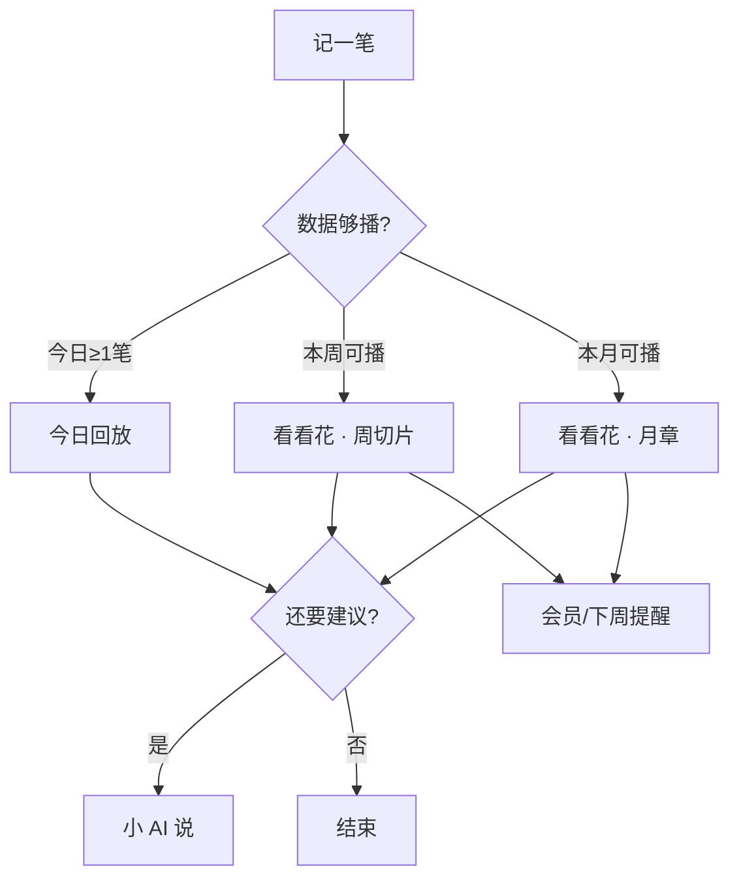

# 叙账 · 产品北极星

> 更新时间：2026-06-02\
> 状态：定稿（战略层；功能细则见 `PRD_v0.1.md`、`PRODUCT_PLAYBACK_MEMBERSHIP_v0.1.md`）\
> 读者：产品、设计、开发、运营、商店文案

***

## 1. 北极星一句话

**让用户用「叙」的方式完成生活回望——把一段时间的花费，温柔地讲清楚；账是素材，叙是目的。**

成功时，用户说的不是「我记了一笔账」，而是 **「它帮我讲完了这周 / 这个月。」**

***

## 2. 命名即战略

| 字     | 含义          | 产品职责                                  |
| ----- | ----------- | ------------------------------------- |
| **叙** | 述说、交谈、叙事    | 可播放的回看（今日 / 周切片 / 月生活章）、旁白、生活配方、宠物讲述者 |
| **账** | 真实、可聚合的消费记录 | 本地记账、分类、统计、OCR——为「叙」提供可信数据，本身不是终点     |

**生活回望**：不是查余额、不是审计式报表，而是 **站在一段时间之后再看见自己怎么过的**。

内部宪法（所有需求评审用）：

> **先叙后议** — 先让用户「看见并讲完」这段时间，再给 AI 交谈式建议；记账只为积累「可叙之材」。

***

## 3. 我们是什么 / 不是什么

| 我们是                   | 我们不是             |
| --------------------- | ---------------- |
| **回望型记账伴侣**           | 预算纪律 / 控消费教练     |
| 温柔、不评判的消费叙事           | 骂「乱花钱」「要省钱」的工具   |
| 记 → 播（看见）→ 谈（AI 建议）闭环 | 功能堆叠型「又一个记账 App」 |
| 本地优先，登录为增强            | 必须先注册才能用的账本      |
| 情绪价值 + 省力（场景包、OCR）    | 靠阉割基础记账逼付费       |

**品类一格**：个人消费领域的 **「时间轴式生活回望」**，不是记账效率榜前五。

***

## 4. 目标用户

**核心用户（愿付费）**

*   想记、但受不了严苛预算 App 的语气
*   周末 / 月底愿意花约 1 分钟 **「看懂这段时间」**
*   需要 OCR、场景备注减少「叙」之前的摩擦

**边缘用户（可服务但不讨好）**

*   只记不看的极简党 → 保留记账，用今日回放轻触达
*   极度反感宠物 → `plain` 模式与宠物关完整可用

**非目标用户（不迎合）**

*   报销、多账本、投资记账、强预算管控
*   只要 3 秒记完、绝不回看的人

***

## 5. 核心体验循环

```text
        ┌──────────┐
        │  记（账） │  手动 / OCR → 本地真实数据
        └────┬─────┘
             ▼
        ┌──────────┐
        │  叙（望） │  今日回放 · 周切片 · 月生活章（主锚点）
        └────┬─────┘     生活配方 = 叙中的「构成」一章
             ▼
        ┌──────────┐
        │  议（谈） │  AI 复盘：理解 + 轻建议（不替代切片）
        └──────────┘
```

| 阶段 | 用户感受           | 主入口                   |
| -- | -------------- | --------------------- |
| 记  | 「没添太多麻烦」       | 记账 Tab                |
| 叙  | 「原来我这周/月是这样过的」 | **看看花 · 生活切片**（北极星触点） |
| 议  | 「像被交谈了一句」      | 小 AI 说（播完切片后再导流）      |

**Tab 叙事顺序**：今日（日叙）→ 看看花（周/月叙）→ 小 AI 说（议，**可选**）；记账是输入层，小窝是身份与会员。

### 5.1 能力层级（AI 非核心）

| 层级       | 能力                                    | 用户离开仍会想念的吗          |
| -------- | ------------------------------------- | ------------------- |
| **核心**   | 生活切片 / 生活章、今日回放、生活配方、切片旁白（**本地模板即可**） | ✅ 这是「叙账」之本          |
| **重要**   | 省力记账：场景包、OCR、宠物昵称与讲述模板                | ✅ 支撑「常记常叙」          |
| **可选增强** | 小 AI 说：远程 AI 复盘、季/年深度文案               | ❌ 没有 AI 也应完成一次满意的回望 |

**产品立场**

*   **叙账不是 AI 记账 App**；AI 是播完后的 **可选项**，不是北极星，也不进主标语。
*   切片幕内用 **本地聚合 + 模板旁白** 讲完故事；AI 仅在用户想要「多交谈一句」时使用。
*   v0.1 即使 ai-proxy 不可用，**播放周/月切片仍须完整可用**（fallback 文案与今日回放同级）。
*   会员转化主因：**无限叙（切片）+ 省力记**；AI 无限次放在权益五条 **靠后**，勿作为商店首图卖点。

**小 AI 说 Tab**：保留（老用户与深度用户），但 **不占动线 C 位**；无网络、无额度时静默降级，不阻断「叙」闭环。

***

## 6. 关键动线（引导型）

结构动线已对齐 §5；本节补齐 **触达与引导**，解决「五 Tab 平权、叙靠用户自己发现」的问题。实现细则可写入 PRD / 专篇 Phase C。

### 6.1 主路径（默认故事线）

```text
记一笔 →（日）今日回放 ~10s →（周/月）看看花 · 生活切片 ──→ 会员 / 下周再叙
                              │
                              └──（可选）小 AI 说 · 多聊一句
```



**最大断点**：**记 → 看看花**。以下规则优先修补该断点。

### 6.2 分阶段触达

| 时机          | 触发条件                | 引导动作                                | 目标       |
| ----------- | ------------------- | ----------------------------------- | -------- |
| **首记**      | 生涯第 1 笔保存成功         | 轻提示 / Sheet：「用 10 秒叙一下今天」→ **今日回放** | 建立「记完有叙」 |
| **第 1～3 天** | 当日有记录               | 首页保留今日回放入口；**不**强推 AI Tab           | 日叙习惯     |
| **本周可播**    | 本周 ≥3 笔且本周未播        | 看看花 Tab **角标**或首页条：「本周生活切片可播放」      | 引向北极星触点  |
| **自然周后半**   | 周五～周日 & 本周未播 & 有数据  | 同上，文案偏「这周快结束了，要不要听一遍」               | 周节律      |
| **新自然周**    | 周一 0 点后刷新免费次数       | 卡片：「新的一周，剩余 1 次本周叙」                 | 复播       |
| **月底**      | 用户切到「本月」或日历月末 25 日后 | 卡片突出 **剩余 x/3** 月章；避免冷锁无解释          | 月叙 + 转化  |
| **记而不播**    | 累计 ≥5 笔且从未完整播放周切片   | 看看花卡片：「已记 N 笔，可以讲这周的故事了」            | 挽回断点     |

### 6.3 看看花页默认态

| 用户 | 默认时间筛选  | 原因               |
| -- | ------- | ---------------- |
| 免费 | **本周**  | 可播、避免第一眼「本月锁定」挫败 |
| 会员 | 本周或上次停留 | 与免费一致，降低认知负担     |

生活切片卡片 **始终在筛选栏下、总览上**（见回放专篇 §5.2）。

### 6.4 播完 CTA（先叙后议）

| 场景                 | 主 CTA                 | 次 CTA               | 避免                |
| ------------------ | --------------------- | ------------------- | ----------------- |
| **今日回放结束**         | 继续记 / 关闭              | 弱提「周末来看周切片」         | 当场强推会员            |
| **周切片播完**          | 「了解会员」或「下周再来」         | 次要：「想多聊一句？」→ 小 AI 说 | 把 AI 设为主 CTA      |
| **月章播完（终生 1～3 次）** | 「了解会员」+ 一句价值（6 章完整月叙） | 「先看本周」；AI 仅次要入口     | 不说「次数没了」却不提曾享 3 次 |
| **月章用尽后**          | 「了解会员」                | 「本周仍有每周 1 次」        | 冷冰冰锁死             |

原则：**播完是转化窗口，不是播放中途打断。**

### 6.5 新用户 7 日内 Tab 权重

| 强化             | 弱化                       |
| -------------- | ------------------------ |
| 今日回放、看看花生活切片卡片 | 小 AI 说首屏主推、以 AI 为卖点的会员弹窗 |

小 AI 说 Tab 保留但不主推；**无 AI 也能完成核心回望**。

### 6.6 动线验收（与 NSM 联动）

*   [ ] 首记后 24h 内 **今日回放** 启动率
*   [ ] 首周 **周切片首播** 转化率（§6.2 辅助指标）
*   [ ] 看看花落地默认 **本周**（免费）
*   [ ] 播完 CTA 符合 §6.4，无中途付费墙
*   [ ] 「记 ≥5 笔未播」用户收到看看花引导且 **7 日内播放率** 提升

***

## 7. 北极星指标（NSM）

### 7.1 主指标（North Star Metric）

**每周至少完成 1 次「生活切片 / 生活章」完整播放的活跃记账用户数（WAU-Playback）**

*   「完整播放」：周 5 幕 / 月 6 章播完 ≥80%，或用户明确播完（与扣次规则一致）
*   理由：直接衡量 **「叙」是否发生**，比「打开 App」「记了几笔」更贴近愿景

### 7.2 辅助指标（健康度）

| 指标               | 说明                 | 警示            |
| ---------------- | ------------------ | ------------- |
| **首播转化率**        | 注册 7 日内首次完整播放周切片   | 低 → 引导弱或切片未打动 |
| **记账 → 播放间隔**    | 有记录用户从记第一笔到首次播放的天数 | 过长 → 仍像普通记账   |
| **播完 → 会员页访问**   | 免费额度用尽或播完当次        | 商业化触点         |
| **周切片自然周复播率**    | 免费用户下周是否再播         | 回望习惯是否形成      |
| **月章终生 3 次消耗曲线** | 第 1/2/3 次间隔        | 验证 3 次是否合理    |
| **7 日记账留存**      | 至少 3 笔可播弱数据        | 无数据则叙为空       |

### 7.3 反指标（不做虚荣增长）

*   不以「功能点击数」「Tab 切换数」单独论功
*   不以「AI 调用次数」替代播放（AI 是议，不是叙）
*   不为拉高 DAU 做评判式 Push（违背不制造焦虑）

***

## 8. 产品设计原则（评审清单）

1.  **先叙后议** — 新功能默认服务「讲完故事」；AI 为可选，不能成为主路径依赖。
2.  **看见优先于建议** — 切片幕内不说教、不依赖大模型；长建议仅在小 AI 说或播后 **次要** CTA。
3.  **无 AI 亦成立** — 任何版本下架远程 AI，用户仍应能播完周/月切片并感到价值完整。
4.  **账真实、叙温柔** — 数字来自本地聚合；语气遵守禁止词（超支、浪费、克制等）。
5.  **记账主流程不阉割** — 免费可记、可看列表与基础统计；深度回望与省力能力划给会员。
6.  **一次一屏一重点** — 每幕 1 个核心数字 + 1 句人话；禁止月章逐笔滚流水。
7.  **宠物是讲述者，不是产品全部** — `warm` / `plain` 等价可用；商店需体现可关。
8.  **免费能尝、会员能续叙** — 周 1 次/自然周 + 月章终生 3 次；用尽话术尊重用户。
9.  **权益说清且做到** — 会员五条、次数限制与代码 `enforce` 一致。

**功能评审三问**

1.  这是在帮用户 **记**，还是 **叙**，还是 **议**？若都不是，为何存在？
2.  没有它，用户还能完成一次「生活回望」吗？
3.  免费用户会感到被欺骗或突然挨骂吗？

***

## 9. 对外表达（商店与品牌）

**推荐主标语**

> **叙账 — 把生活开支，温柔地讲给你听。**

**副标语（可选）**

> 记账为了积累生活；回望时，用周与月的故事看懂自己。

**避免作为主标题**

*   「智能记账」「AI 记账助手」（弱化叙、强化commodity AI）
*   「帮你省钱」「预算管理」（与价值观冲突）

**截图 / 视频顺序建议** — 完整截屏说明、叠字文案与标题方案见 **[`APP_STORE_LISTING.md`](APP_STORE_LISTING.md)**。

1.  统计页 · 播放本周/本月生活切片
2.  播放中 · 数字 + 生活配方环图
3.  今日回放 · 10 秒
4.  记账 + 场景包（省力）
5.  （可选）小 AI 说 — 勿作为商店首图

***

## 10. 与功能文档的关系

| 文档                                         | 承载内容                     |
| ------------------------------------------ | ------------------------ |
| **本文**                                     | 为什么做、为谁做、关键动线、NSM、评审原则   |
| `PRD_v0.1.md`                              | 页面、字段、Prompt、技术结构        |
| `PRODUCT_PLAYBACK_MEMBERSHIP_v0.1.md`      | 三种回看、切片、会员、次数、权益五条、视觉分层  |
| `TODO.md`                                  | 落地排期                     |
| `APP_STORE_LISTING.md`                     | 商店标题、截图顺序、关键词与上架自检       |
| `IMPLEMENTATION_FOR_CODEX.md`              | Agent 分任务实现（B1～D1）、提示词模板 |
| `PRODUCT_PLAYBACK_MEMBERSHIP_v0.1.md` §5.8 | 切片感染力、旁白模板与播完率验收         |

新增需求：**先对齐北极星 §5 循环、§6 动线与 §8 原则**，再写入 PRD / 专篇。

***

## 11. 修订记录

| 日期         | 说明                                               |
| ---------- | ------------------------------------------------ |
| 2026-06-02 | 首版：生活回望、叙/账释义、先叙后议、NSM、原则与对外标语                   |
| 2026-06-02 | 新增 **§6 关键动线**：首记/周末引导、默认本周、播完 CTA、记而不播挽回、动线验收   |
| 2026-06-02 | 新增 **§5.1 能力层级**：叙为核心、AI 为可选增强；播完 CTA 与权益排序以切片为先 |

