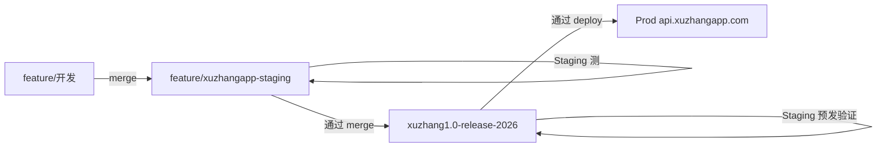

# 叙账 · 同机测试环境（Staging）操作说明

> 适用：仅有一台阿里云 ECS，在生产环境旁再部署一套 **staging**，供内测 / 联调 / 发版预验证。\
> 生产域名：`https://api.xuzhangapp.com`\
> 测试域名（建议）：`https://staging-api.xuzhangapp.com`

***

## 1. 架构概览

```text
                         ┌─ api.xuzhangapp.com
                         │       Nginx :443 → backend :8790 → ai-proxy :8787
同一台 ECS (47.102.205.254) │       PostgreSQL: xuzhang
                         │       pm2: backend, ai-proxy
                         │       目录: /opt/xuzhang/xuzhangapp（示例）
                         │
                         └─ staging-api.xuzhangapp.com
                                 Nginx :443 → backend :8791 → ai-proxy :8788
                                 PostgreSQL: xuzhang_staging
                                 pm2: backend-staging, ai-proxy-staging
                                 目录: /opt/xuzhang/xuzhangapp-staging（示例）
```

| 项目          | 生产 (prod)              | 测试 (staging)                           |
| ----------- | ---------------------- | -------------------------------------- |
| 域名          | `api.xuzhangapp.com`   | `staging-api.xuzhangapp.com`           |
| backend 端口  | 8790                   | **8791**                               |
| ai-proxy 端口 | 8787                   | **8788**                               |
| 数据库         | `xuzhang`              | **`xuzhang_staging`**                  |
| pm2 进程名     | `backend` / `ai-proxy` | `backend-staging` / `ai-proxy-staging` |
| 验证码         | 上架前应关闭 dev 码           | 可保留 `DEV_ALLOW_SMS_CODE=123456`        |
| JWT / Token | 独立                     | **必须与 prod 不同**                        |
| SSL 证书      | 见 §9.1                 | 见 §9.1（待申请 / 部署）                       |

**原则**：数据、密钥、域名彻底隔离；staging 异常不影响 prod 用户。

***

## 2. 分支与发版流程

### 2.1 分支角色（固定）

| 分支                           | 角色            | 谁在用                      |
| ---------------------------- | ------------- | ------------------------ |
| `feature/*`                  | **开发分支**      | 本机日常开发                   |
| `feature/xuzhangapp-staging` | **测试分支**      | Staging 测新功能             |
| `xuzhang1.0-release-2026`    | **生产 / 发版分支** | Staging 预发验证 + Prod 正式环境 |

```text
feature/xxx  ──merge──►  feature/xuzhangapp-staging  ──merge──►  xuzhang1.0-release-2026
     开发                    测试分支                         生产发版线
```

### 2.2 全流程

```text
① 开发分支完成
      ↓ merge / PR
② 测试分支 feature/xuzhangapp-staging
      ↓ Staging 服务器 checkout 测试分支 + pull + 重启 pm2
      ↓ 真机 / TestFlight 测 staging-api
③ 测试通过
      ↓ merge / PR（测试分支 → 发版分支）
④ 生产分支 xuzhang1.0-release-2026
      ↓ Staging 服务器 checkout 发版分支 + pull + 重启 pm2  ← 「测试环境跑生产分支」
      ↓ 再验一轮（与即将上线代码一致）
⑤ 通过
      ↓ Prod 服务器 checkout 发版分支 + pull + 重启 pm2
⑥ 正式上线
```

**要点**：

*   新功能 **先进测试分支**，不直接 merge 进发版分支。
*   发版分支合并后，**先在 Staging 上跑发版分支** 做最后一轮验证，再动 Prod。



### 2.3 各步 Git 操作

#### 步骤 ① → ②：开发分支合并到测试分支

**GitHub PR（推荐）**

*   Base：`feature/xuzhangapp-staging`
*   Compare：`feature/你的功能分支`
*   Merge

**或本机：**

```bash
git checkout feature/xuzhangapp-staging
git pull origin feature/xuzhangapp-staging

git merge feature/你的功能分支
# 解决冲突后
git push origin feature/xuzhangapp-staging
```

#### 步骤 ②：Staging 跑 **测试分支**

```bash
cd /opt/xuzhang/xuzhangapp-staging
git fetch origin
git switch feature/xuzhangapp-staging
git pull origin feature/xuzhangapp-staging

cd backend && npm install --omit=dev
cd ../ai-proxy && npm install --omit=dev
pm2 restart backend-staging ai-proxy-staging

curl -s https://staging-api.xuzhangapp.com/health
```

iOS 连：`https://staging-api.xuzhangapp.com` → 验证新功能。

#### 步骤 ③ → ④：测试分支合并到 **生产发版分支**

**PR：**

*   Base：`xuzhang1.0-release-2026`
*   Compare：`feature/xuzhangapp-staging`
*   Merge（测试通过后再合）

**或本机：**

```bash
git checkout xuzhang1.0-release-2026
git pull origin xuzhang1.0-release-2026

git merge feature/xuzhangapp-staging
git push origin xuzhang1.0-release-2026
```

#### 步骤 ④：Staging 跑 **生产发版分支**（预发验证）

```bash
cd /opt/xuzhang/xuzhangapp-staging
git fetch origin
git switch xuzhang1.0-release-2026
git pull origin xuzhang1.0-release-2026

pm2 restart backend-staging ai-proxy-staging
curl -s https://staging-api.xuzhangapp.com/health
```

再跑一遍：**登录、记账、同步、AI**（与上线相同路径）。\
此时 Staging **代码** = 即将上 Prod 的代码；数据库仍用 **`xuzhang_staging`**（与 prod 数据隔离）。

#### 步骤 ⑤ → ⑥：Prod 部署发版分支

```bash
cd /opt/xuzhang/xuzhangapp    # 生产目录，以实际为准
git fetch origin
git switch xuzhang1.0-release-2026
git pull origin xuzhang1.0-release-2026

pm2 restart backend ai-proxy
curl -s https://api.xuzhangapp.com/health
```

### 2.4 Staging 在两阶段分别测什么

| 阶段      | Staging checkout 分支          | 验证什么                 |
| ------- | ---------------------------- | -------------------- |
| **第一轮** | `feature/xuzhangapp-staging` | 新功能、联调、Bug 修复        |
| **第二轮** | `xuzhang1.0-release-2026`    | 发版包完整性、与 Prod 一致、无遗漏 |

同一台 Staging、同一域名 `staging-api.xuzhangapp.com`，**只换 checkout 的分支**；`.env`（8791 / 8788 / staging 库）不变。

### 2.5 下一轮开发怎么继续

测试 / 发版都完成后，Staging 切回测试分支继续接新功能：

```bash
cd /opt/xuzhang/xuzhangapp-staging
git fetch origin
git switch feature/xuzhangapp-staging
git pull origin feature/xuzhangapp-staging
pm2 restart backend-staging ai-proxy-staging
```

开发分支继续 merge 到 **`feature/xuzhangapp-staging`**，重复 §2.2 流程。

**命令速查：**

```bash
# 切到测试分支并更新
git fetch origin
git switch feature/xuzhangapp-staging
git pull
pm2 restart backend-staging ai-proxy-staging

# 切到发版分支并更新（预发验证）
git fetch origin
git switch xuzhang1.0-release-2026
git pull
pm2 restart backend-staging ai-proxy-staging
```

### 2.6 团队规则小结

1.  **禁止** feature 直接 merge 进 `xuzhang1.0-release-2026`（紧急 hotfix 除外）。
2.  **只有** `feature/xuzhangapp-staging` 在 Staging 测通过后，才能 merge 到发版分支。
3.  **发版分支** merge 后，**必须**在 Staging 上 checkout 发版分支验过，再部署 Prod。
4.  Prod **只** 跟踪 `xuzhang1.0-release-2026`，不直接跟踪 feature 分支。
5.  发版分支 **尽量只 merge，少直接 commit**，历史更清晰。

***

## 3. 前置条件

*   [x] 生产环境已运行（`pm2 list` 可见 `backend`、`ai-proxy`）
*   [x] PostgreSQL 已安装，生产库 `xuzhang` 可用
*   [x] Nginx + HTTPS 已配置（`api.xuzhangapp.com`）
*   [x] 域名控制台可添加 DNS 解析
*   [ ] 备案已完成（staging 子域同样建议走 HTTPS）

***

## 4. 步骤一：DNS

在域名服务商添加 **A 记录**：

| 主机记录          | 类型 | 记录值              |
| ------------- | -- | ---------------- |
| `staging-api` | A  | `47.102.205.254` |

生效后验证：

```bash
ping staging-api.xuzhangapp.com
```

***

## 5. 步骤二：创建测试数据库

SSH 登录服务器后：

```bash
sudo -u postgres psql
```

```sql
CREATE DATABASE xuzhang_staging;
GRANT ALL PRIVILEGES ON DATABASE xuzhang_staging TO xuzhang;
\q
```

> 用户名 / 密码与生产 `.env` 中 `DATABASE_URL` 保持一致，仅库名不同。

***

## 6. 步骤三：部署 staging 代码目录

**不要与生产共用同一目录**，避免 `git pull` 互相覆盖。

```bash
mkdir -p /opt/xuzhang/xuzhangapp-staging
cd /opt/xuzhang/xuzhangapp-staging
git clone -b feature/xuzhangapp-staging git@github.com:colivm/xuzhangapp.git .
```

> 最后的 **`.`** 表示克隆到当前目录，不再多一层子文件夹。\
> 指定分支用 **`-b 分支名`**，不要用分支名当文件夹名。

安装依赖：

```bash
cd /opt/xuzhang/xuzhangapp-staging/ai-proxy && npm install
cd /opt/xuzhang/xuzhangapp-staging/backend && npm install
```

***

## 7. 步骤四：配置 staging 环境变量

模板见 `backend/.env.staging.example`。

**生成 Staging 专用 `JWT_SECRET`**（勿与生产相同）：

```bash
openssl rand -hex 32
```

将输出写入下面 **7.1 backend** 与 **7.2 ai-proxy** 的 `JWT_SECRET`（两处必须一致）。\
生成与轮换说明见 [`PROJECT_SETUP.md` §3.1](PROJECT_SETUP.md)。

### 7.1 `backend/.env`

```env
PORT=8791
JWT_SECRET=<staging-专用，openssl rand -hex 32 生成，勿与 prod 相同>
ALLOW_ORIGIN=*

AI_PROXY_BASE_URL=http://127.0.0.1:8788
AI_PROXY_TOKEN=
DEV_ALLOW_SMS_CODE=123456
DATABASE_URL=postgres://xuzhang:<密码>@127.0.0.1:5432/xuzhang_staging
```

### 7.2 `ai-proxy/.env`

```env
PORT=8788
AI_UPSTREAM_URL=https://api.deepseek.com/v1/chat/completions
AI_UPSTREAM_API_KEY=<你的 DeepSeek Key>
AI_UPSTREAM_MODEL=deepseek-chat
JWT_SECRET=<与 backend 验 JWT 策略一致，勿用 prod 密钥>
REQUIRE_JWT=1
```

> **注意**：`AI_PROXY_BASE_URL` 必须 **8788**；`DATABASE_URL` 必须 **`xuzhang_staging`**。

***

## 8. 步骤五：pm2 启动 staging 进程

**必须在 staging 目录下启动**，才会读 staging 的 `.env`；`--name ai-proxy-staging` 只是进程别名。

```bash
cd /opt/xuzhang/xuzhangapp-staging/ai-proxy
pm2 start server.js --name ai-proxy-staging

cd /opt/xuzhang/xuzhangapp-staging/backend
pm2 start src/server.js --name backend-staging

pm2 save
pm2 list
```

确认 cwd 与端口：

```bash
pm2 show ai-proxy-staging    # exec cwd 应在 xuzhangapp-staging/ai-proxy
curl -s http://127.0.0.1:8788/health
curl -s http://127.0.0.1:8791/health
```

***

## 9. 步骤六：Nginx 配置 staging 域名

### 9.1 SSL 证书路径（ECS 实际）

证书文件在服务器本地，**不在 Git 仓库**。在 ECS 上查当前配置：

```bash
grep -r "ssl_certificate" /etc/nginx/
```

**生产（已部署）**

| 项目         | 路径                                              |
| ---------- | ----------------------------------------------- |
| Nginx 站点配置 | `/etc/nginx/sites-available/api.xuzhangapp.com` |
| 证书（公钥 + 链） | `/etc/nginx/ssl/api.xuzhangapp.com.pem`         |
| 私钥         | `/etc/nginx/ssl/api.xuzhangapp.com.key`         |

对应配置片段：

```nginx
ssl_certificate     /etc/nginx/ssl/api.xuzhangapp.com.pem;
ssl_certificate_key /etc/nginx/ssl/api.xuzhangapp.com.key;
ssl_protocols TLSv1.2 TLSv1.3;
```

**测试 staging（建议与 prod 同目录命名，待部署）**

| 项目         | 建议路径                                                    |
| ---------- | ------------------------------------------------------- |
| Nginx 站点配置 | `/etc/nginx/sites-available/staging-api.xuzhangapp.com` |
| 证书         | `/etc/nginx/ssl/staging-api.xuzhangapp.com.pem`         |
| 私钥         | `/etc/nginx/ssl/staging-api.xuzhangapp.com.key`         |

> 若使用 **Let's Encrypt / Certbot**，路径通常为 `/etc/letsencrypt/live/<域名>/fullchain.pem` 与 `privkey.pem`；本项目 prod 为阿里云下载后手动放在 `/etc/nginx/ssl/`。\
> `/etc/nginx/snippets/snakeoil.conf` 为系统自带自签名证书，**与叙账无关**，可忽略。

**校验证书文件与有效期：**

```bash
ls -la /etc/nginx/ssl/api.xuzhangapp.com.*
openssl x509 -in /etc/nginx/ssl/api.xuzhangapp.com.pem -noout -subject -dates
```

**申请 staging 证书后部署：**

1.  将 `.pem` / `.key` 上传到 `/etc/nginx/ssl/`（权限：证书 `644`，私钥 `600`）。
2.  新建或启用 `/etc/nginx/sites-available/staging-api.xuzhangapp.com`（见 §9.2）。
3.  `nginx -t && systemctl reload nginx`。

测试证有效期见 `TODO.md`（当前 prod 测试证至 **2026-08-29** 前需续签或换正式 DV 证）。

### 9.2 staging Nginx 配置

```nginx
server {
    listen 443 ssl http2;
    server_name staging-api.xuzhangapp.com;

    ssl_certificate     /etc/nginx/ssl/staging-api.xuzhangapp.com.pem;
    ssl_certificate_key /etc/nginx/ssl/staging-api.xuzhangapp.com.key;
    ssl_protocols TLSv1.2 TLSv1.3;

    location / {
        proxy_pass http://127.0.0.1:8791;
        proxy_http_version 1.1;
        proxy_set_header Host $host;
        proxy_set_header X-Real-IP $remote_addr;
        proxy_set_header X-Forwarded-For $proxy_add_x_forwarded_for;
        proxy_set_header X-Forwarded-Proto $scheme;
    }
}

server {
    listen 80;
    server_name staging-api.xuzhangapp.com;
    return 301 https://$host$request_uri;
}
```

```bash
nginx -t
systemctl reload nginx
curl -s https://staging-api.xuzhangapp.com/health
```

***

## 10. 步骤七：安全组与防火墙

| 端口                        | 公网   | 说明      |
| ------------------------- | ---- | ------- |
| 80 / 443                  | ✅ 开放 | 仅 Nginx |
| 8790 / 8791 / 8787 / 8788 | ❌ 关闭 | 仅本机访问   |

***

## 11. 客户端如何使用

### iOS TestFlight / 内测包

| 设置项     | staging 值                                                |
| ------- | -------------------------------------------------------- |
| 后端根地址   | `https://staging-api.xuzhangapp.com`                     |
| AI 接口地址 | `https://staging-api.xuzhangapp.com/v1/ai/insight/daily` |
| 验证码     | `123456`（若 staging 保留 dev 码）                             |

### App Store 正式包

| 设置项     | prod 值                                           |
| ------- | ------------------------------------------------ |
| 后端根地址   | `https://api.xuzhangapp.com`                     |
| AI 接口地址 | `https://api.xuzhangapp.com/v1/ai/insight/daily` |

***

## 12. 日常发布流程（摘要）

完整分支规则见 **§2**。服务器侧只做三件事：**fetch → switch 分支 → pull → restart pm2**。

| 场景   | 分支                           | 服务器命令要点                                             |
| ---- | ---------------------------- | --------------------------------------------------- |
| 测新功能 | `feature/xuzhangapp-staging` | `git switch feature/xuzhangapp-staging && git pull` |
| 预发验证 | `xuzhang1.0-release-2026`    | `git switch xuzhang1.0-release-2026 && git pull`    |
| 正式上线 | `xuzhang1.0-release-2026`    | 在 **prod 目录** pull + `pm2 restart backend ai-proxy` |

***

## 13. 常用运维命令

```bash
pm2 list
pm2 show backend-staging
pm2 logs backend-staging --lines 100
pm2 restart backend-staging ai-proxy-staging
pm2 stop backend-staging ai-proxy-staging
pm2 save

# 当前 git 分支
cd /opt/xuzhang/xuzhangapp-staging && git branch && git log -1 --oneline
```

***

## 14. 验收清单

*   [ ] `https://staging-api.xuzhangapp.com/health` 返回 `ok: true`
*   [ ] 测试分支在 Staging 验收通过
*   [ ] 发版分支在 Staging 预发验证通过
*   [ ] Prod 仅部署 `xuzhang1.0-release-2026`
*   [ ] staging / prod 数据库、JWT、端口互不串

***

## 15. 故障排查

| 现象                        | 可能原因               | 处理                            |
| ------------------------- | ------------------ | ----------------------------- |
| staging 502               | 进程未启动              | `pm2 restart backend-staging` |
| 像 prod 数据                 | `DATABASE_URL` 指错  | 确认 `xuzhang_staging`          |
| pm2 名是 staging 但跑 prod 端口 | 在错误目录 start        | `pm2 delete` 后在 staging 目录重装  |
| 换分支后仍是旧代码                 | 未 pull / 未 restart | `git pull` + `pm2 restart`    |
| 看不到新远程分支                  | 未 fetch            | `git fetch origin`            |

***

## 16. 相关文档

*   **`PROJECT_SETUP.md`** — 项目搭建总览（本机 / 生产 / Staging 索引）
*   `PROJECT_ANALYSIS.md` — 架构与完成度分析
*   `backend/.env.staging.example` — staging backend 环境变量模板
*   `backend/README.md` — 后端接口与本地启动
*   `ai-proxy/README.md` — AI 代理配置
*   `API_v0.1.md` — API 说明
*   `TODO.md` — 项目进度与上线清单

***

## 17. 目录与路径备忘

| 说明                   | 示例路径                                                    |
| -------------------- | ------------------------------------------------------- |
| 生产代码                 | `/opt/xuzhang/xuzhangapp`                               |
| 测试代码                 | `/opt/xuzhang/xuzhangapp-staging`                       |
| 测试分支                 | `feature/xuzhangapp-staging`                            |
| 发版分支                 | `xuzhang1.0-release-2026`                               |
| ECS IP               | `47.102.205.254`                                        |
| prod Nginx 站点        | `/etc/nginx/sites-available/api.xuzhangapp.com`         |
| prod SSL 证书          | `/etc/nginx/ssl/api.xuzhangapp.com.pem`                 |
| prod SSL 私钥          | `/etc/nginx/ssl/api.xuzhangapp.com.key`                 |
| staging Nginx 站点（待建） | `/etc/nginx/sites-available/staging-api.xuzhangapp.com` |
| staging SSL 证书（待建）   | `/etc/nginx/ssl/staging-api.xuzhangapp.com.pem`         |
| staging SSL 私钥（待建）   | `/etc/nginx/ssl/staging-api.xuzhangapp.com.key`         |

